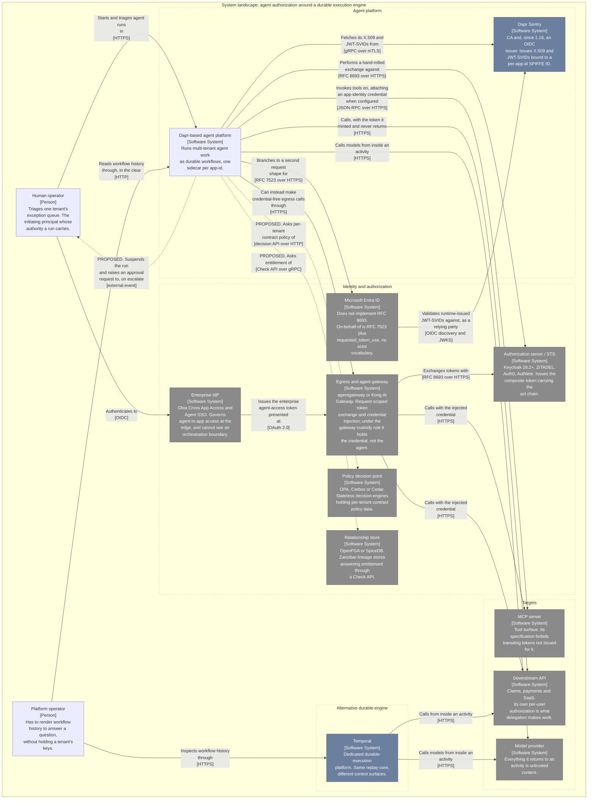

# Durable execution notes

Working notes on durable-execution engines and the authorization problems they inherit: how these systems actually behave, where their control surfaces differ, and which of those differences change a design decision.

## The landscape

*System Landscape (C4 level 1): who participates in agent authorization around a durable execution engine, and which of those participants do not exist yet?*

**Key.** Solid borders and solid arrows are what ships today. Dotted arrows whose label begins **PROPOSED** are relationships that do not exist: they are design in this repository, not code. Grey fill is a third-party or another-team system; slate fill is platform infrastructure; unfilled elements are the ones these notes are written about. The dashed boxes are grouping only, not trust or network boundaries.

Generated from [`docs/architecture/workspace.dsl`](docs/architecture/workspace.dsl), which is the single source for every C4 view in this repository; regenerate with `tools/build-diagrams.sh`.

## Notes

- [**Dapr Workflow vs. Temporal: where the gaps actually are**](dapr-workflow-vs-temporal.md) — both are log-based, event-sourced engines that recover by deterministic replay, so the differences are not in the core model. They are in execution control (Dapr has no activity timeouts and no heartbeat), versioning, payload ceilings, and history hygiene. Includes a summary table and a choosing-between-them section.

## Agent authorization

- [**What actually implements RFC 8693 and RFC 9396**](rfc-8693-and-9396-in-practice.md) — an implementation survey finding that the two halves of agent authorization are in wildly different states: OAuth token exchange is a shipping commodity across Keycloak, ZITADEL, Authlete, Auth0 and every serious gateway, while Rich Authorization Requests is a ratified standard that zero of nineteen reachable public authorization servers advertised in discovery as of August 2026. The sample is biased against RAR by construction and says so. Includes the argument that RFC 9396 enforcement is custom by specification, and that the exception is a workflow engine, which owns its own action boundary.

- [**Typed grants and provenance in a durable execution engine**](typed-grants-in-a-durable-engine.md) — the design notes the delegated-identity proposal was cut down from, covering the three things that proposal dropped: how a runtime composes with an enterprise IdP protocol by being the attestation underneath it and terminating it at the edge, why a policy building block should abstract the question rather than the engine and leave relationship writes alone, and why in a durable workflow the activity signature *is* the typed transaction.

- [**Multi-tenant agentic workflows: a worked reference architecture**](multi-tenant-agentic-workflows.md) — one regulated multi-tenant use case driven out into layers, twelve named failure points, and an honest inventory of what a durable runtime already covers, which is more than the usual telling admits. Works out what the grant object holds, why the activity boundary asks three separate policy questions belonging in three different engines, and why step-up authorization is a durable-execution-shaped problem living in the wrong layer.

- [**Typed intent, open intent, and the limits of agent authorization**](typed-intent-and-containment.md) — the argument that the useful line runs between typed and open intent rather than between authorization and judgment: RFC 9396 binds a refund because a refund has fields, and binds nothing about "clean up the staging environment" because that has none. Covers why the dangerous failure is the quiet in-distribution one, and what credential brokering and taint tracking each stop short of.

## Proposals

- [**Delegated Identity and Token Exchange in Dapr**](dapr-delegated-identity-proposal.md) — draft proposal (targeting `dapr/proposals`) adding delegated authority to Dapr in three layers: a pluggable `sts` component type implementing RFC 8693 and its vendor dialects, a delegation context propagated across durable workflow boundaries the way trace context already is, and an `onBehalfOf` auth mode on the consumers that make authenticated outbound calls. The design constraint is that application and activity code stays byte-for-byte unchanged and no bearer token ever reaches the app process, the workflow payload, or the state store.

  The argument for why this belongs in a runtime rather than a gateway is the durable case: a workflow authorized on Tuesday, resumed three days later from a timer, must call an API as a user whose access token expired two days ago and who is not online to re-consent. What survives those three days cannot be a token; it has to be a non-secret delegation context from which a fresh token is minted at call time.

## Method

Claims about how these systems behave today were checked against source, not against documentation prose, by cloning the repositories and reading them at pinned commits. Each document carries its own citations inline and a provenance table naming the commits it was verified at.

That process changed conclusions rather than confirming them. Four claims were refuted outright, one of them reversing a finding that had already survived a review pass — Dapr's state-store encryption does not reach workflow history, which an earlier draft asserted it did on the strength of documentation plus an inference. Where documentation and code disagree, the code is treated as authoritative and the discrepancy is noted rather than silently resolved.

The narrow lesson, recorded because it was expensive: a claim about *where* behavior is applied cannot be settled by confirming that two components exist and are documented as related. It needs the call path.

## Proposals and assessments

Each of these takes one gap named in the comparison and works out what closing it would actually require, against the shipped code.

- [**Activity execution timeouts**](proposal-activity-timeouts.md) — adds two timeouts rather than Temporal's four, enforced so that a timeout firing is a recorded history event rather than a wall-clock read, and argues the cut. Concludes that activity heartbeat should *not* be added: Dapr's persistent work-item stream already gives continuously, for zero writes, the liveness signal Temporal's long-polling has to simulate with periodic ones.

- [**Dapr Workflow versioning as shipped**](assessment-workflow-versioning.md) — began as a proposal to add versioning and became an assessment, because Dapr shipped both mechanisms in 1.17.0. Traces what they built, then names what is still missing: `DeprecatePatch` above all, which is a one-way door today.

- [**Payload limits and history growth**](proposal-payload-limits.md) — argues its own gap down. The actionable-warning phase already shipped, history TTL is already solved, and the remaining cheap win is letting a stalled workflow act on its own behalf instead of waiting for an operator. Claim-check offload should be a separate proposal, because it carries all the lifecycle and replay risk.

- [**A payload codec and a decode service**](proposal-payload-codec.md) — the largest of the four, because the gap turned out to be coverage rather than control. Works out where a codec hook can sit given that Dapr's sidecar is a separate process, and identifies a hard prerequisite: Dapr has no history read API at all, so a decode service has nothing to read.

## Architecture diagrams

The static-structure diagrams in these documents are generated from one Structurizr DSL model at [`docs/architecture/workspace.dsl`](docs/architecture/workspace.dsl) — one model, many views, so they cannot drift from each other. Regenerate with `tools/build-diagrams.sh`, which validates, lints, exports, post-processes and renders, and fails the build if a diagram would render incorrectly on GitHub.

Structurizr's Mermaid export is not directly embeddable: it emits HTML `
` labels, which GitHub renders as literal text because it disables HTML labels, and hardcoded white fills that break dark mode. [`tools/structurizr-mermaid-clean.py`](tools/structurizr-mermaid-clean.py) rewrites both. Sequence diagrams are hand-authored, because Structurizr's dynamic views cannot express the loop blocks and notes those flows depend on.

Anything proposed rather than shipping is marked on three independent channels — dashed border, coloured label, and a description beginning `PROPOSED.` — because no single channel reliably survives the exporter.

## Conventions

Version-dependent claims are dated or pinned to a package version where it matters, because the answers move. Verified behavior is stated as verified; everything else is stated as an argument.
