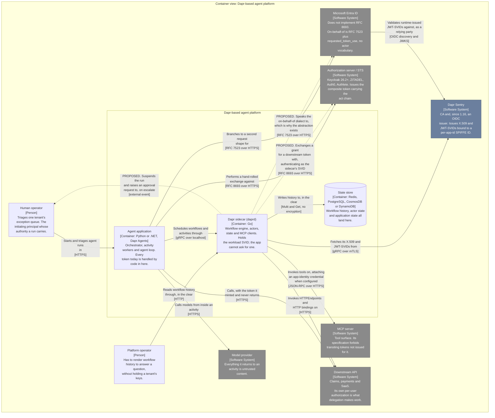
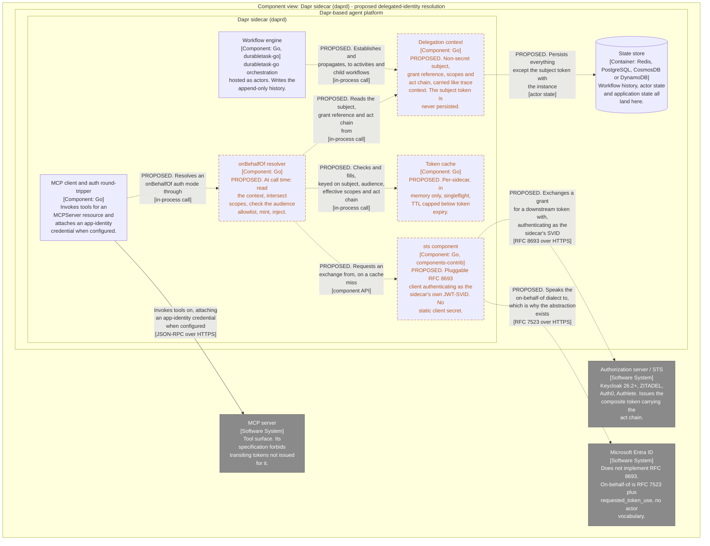

# Proposal: Delegated Identity and Token Exchange

**Status:** Draft
**Target repo:** `dapr/proposals`
**Affects:** `dapr/dapr`, `dapr/components-contrib`, SDKs, docs
**Author:** Allen Sanborn
**Date:** 2026-09

---

## 1. Abstract

Every outbound call in a distributed system carries two independent facts: *who is
making this call* (workload identity) and *on whose authority* (delegated
authority). Dapr handles the first extremely well and has no mechanism for the
second.

This proposal adds delegated authority to Dapr in three layers:

1. A new **`sts` component type** implementing OAuth 2.0 Token Exchange
   (RFC 8693) and its vendor dialects, using the sidecar's existing Sentry-issued
   JWT-SVID as the actor credential.
2. A **delegation context** carried by the workflow runtime and propagated to
   activities and child workflows the way trace context already is.
3. An **`onBehalfOf` auth mode** on the consumers that already make authenticated
   outbound calls — `MCPServer`, `HTTPEndpoint`, and HTTP-family bindings —
   which resolves the context to a real token at call time inside the sidecar.

The design goal is that application and activity code is **byte-for-byte
unchanged**. No token ever enters the application process, the workflow input or
output, or the state store.

> **Note on schema fidelity.** The `MCPServer` YAML below has been reconciled
> against [`pkg/apis/mcpserver/v1alpha1/types.go`](https://github.com/dapr/dapr/blob/v1.18.3/pkg/apis/mcpserver/v1alpha1/types.go)
> at tag `v1.18.3`. An earlier
> draft sketched it from memory and was wrong in every structural element: there
> is no `spec.transport`, `url` and `auth` live under the transport rather than
> at `spec` top level, and `MCPAuth` has no `clientCredentials` key. The
> `HTTPEndpoint` blocks have **not** been verified the same way and remain
> sketches.

---

## 2. Background

### 2.1 What Dapr already has

Dapr has spent several releases building a strong workload identity story:

- **Sentry** acts as a CA, issuing short-lived X.509 SVIDs bound to a SPIFFE ID of
  the form `spiffe://<trust-domain>/ns/<namespace>/<app-id>`, used for automatic
  mTLS between sidecars. The ID is assembled as `"/ns/" + ns + "/" + appID` in
  [`pkg/security/security.go:376`](https://github.com/dapr/dapr/blob/12463d2bfd849eabaef5c2873b314d5d74f861e9/pkg/security/security.go#L376).
- **1.16** extended Sentry to issue **JWT-SVIDs** and expose OIDC discovery
  endpoints (`/.well-known/openid-configuration`, `/jwks.json`), enabling workload
  identity federation with external IdPs. The documented path federates into
  Microsoft Entra ID via a Federated Identity Credential bound to the app's SPIFFE
  ID, with the audience requested through `--sentry-request-jwt-audiences` or the
  `dapr.io/sentry-request-jwt-audiences` annotation. The version attribution is
  checkable by tag: `pkg/sentry/server/oidc/` and `pkg/sentry/server/ca/jwt/` are
  absent at `v1.15.0` and present at `v1.16.0`. Endpoint constants are in
  [`pkg/sentry/server/oidc/oidc.go:40,42`](https://github.com/dapr/dapr/blob/12463d2bfd849eabaef5c2873b314d5d74f861e9/pkg/sentry/server/oidc/oidc.go#L40-L42);
  the annotation is in
  [`pkg/injector/annotations/annotations.go:81`](https://github.com/dapr/dapr/blob/12463d2bfd849eabaef5c2873b314d5d74f861e9/pkg/injector/annotations/annotations.go#L81).
- **1.18** added **per-audience token SVIDs** in Sentry —
  `resp.GetPerAudienceJwts()` and `spiffe.SVIDResponse.PerAudienceJWT` appear in
  [`pkg/security/sentry.go`](https://github.com/dapr/dapr/blob/12463d2bfd849eabaef5c2873b314d5d74f861e9/pkg/security/sentry.go)
  in the `v1.17.0`→`v1.18.3` diff and are absent at `v1.17.0`, alongside a new
  `Handler.FetchJWT(ctx, audience)` — and shipped the **`MCPServer`** resource with
  built-in workflow orchestration for MCP (zero `mcpserver` paths at 1.16 and 1.17,
  full CRD at `v1.18.3`; see
  [`pkg/apis/mcpserver/v1alpha1/types.go`](https://github.com/dapr/dapr/blob/v1.18.3/pkg/apis/mcpserver/v1alpha1/types.go)
  and the design in
  [`20260304-CR-mcpserver.md`](https://github.com/dapr/proposals/blob/main/20260304-CR-mcpserver.md)).
  `MCPAuth`
  offers two credential modes — OAuth2 client credentials (`auth.oauth2`, with the
  client secret resolved at call time via `auth.secretStore`) and SPIFFE JWT-SVID
  injection (`auth.spiffe.jwt`, naming the header, an optional value prefix, and a
  required audience). Static headers are configured separately as
  `spec.endpoint.<transport>.headers`, alongside `auth` rather than inside it. All
  of that shape is read from
  [`types.go` at tag `v1.18.3`](https://github.com/dapr/dapr/blob/v1.18.3/pkg/apis/mcpserver/v1alpha1/types.go).

Two things follow from this. First, Dapr is unambiguously already in the identity
business — Sentry is a CA *and* an OIDC issuer, and daprd already attaches
credentials to outbound tool calls when configured to. Second, every one of those mechanisms answers
only "who is calling."

### 2.2 The gap

There is no component type, API, or configuration in Dapr that expresses "make
this call on behalf of user X." Concretely, none of the following exist:

- A pluggable abstraction over a Security Token Service.
- A way for an application or workflow to obtain a token scoped to a downstream
  audience while preserving an end-user subject.
- A way to carry a user's delegated authority across a durable workflow boundary.
- An actor chain (`act`) recording which agents and services participated in a
  call.

Two absence searches support that. `components-contrib` has exactly ten component-type
directories on master — `bindings`, `configuration`, `conversation`, `crypto`, `lock`,
`middleware`, `nameresolution`, `pubsub`, `secretstores`, `state` — and no `sts`; a
repo-wide grep for `8693` / `token_exchange` / `tokenexchange` hits exactly one file,
[`common/authentication/azure/spiffe.go`](https://github.com/dapr/components-contrib/blob/master/common/authentication/azure/spiffe.go),
which is workload-identity client assertion rather than token exchange. And across all
26 files in [`dapr/proposals`](https://github.com/dapr/proposals), a grep for
`on.behalf.of`, `delegated authorit`, `security token service`, `token exchange` and
`8693` returns only two incidental lines inside the MCPServer proposal describing an
OAuth2 client-credentials failure mode. No prior or in-flight delegation proposal exists.

The nearest existing pieces each fail for a distinct reason:

| Mechanism | Why it doesn't solve this | Source |
| --- | --- | --- |
| `middleware.http.oauth2clientcredentials` | Statically configured per pipeline, all-or-nothing on the invoke path, no subject token, app identity only | [component source](https://github.com/dapr/components-contrib/blob/master/middleware/http/oauth2clientcredentials/oauth2clientcredentials_middleware.go); [docs](https://docs.dapr.io/reference/components-reference/supported-middleware/middleware-oauth2clientcredentials/) |
| `middleware.http.bearer` | Validation of inbound tokens, not acquisition | [docs](https://docs.dapr.io/reference/components-reference/supported-middleware/middleware-bearer/) — "verifies a Bearer Token using OpenID Connect on a Web API" |
| `secretstores` | Static credentials; wrong shape entirely | components-contrib directory listing |
| `crypto` | Key operations on payloads, not token issuance | [docs](https://docs.dapr.io/developing-applications/building-blocks/cryptography/cryptography-overview/) |
| Component Azure auth profiles | Perform a real exchange, but hardcoded per cloud and not reachable from application or workflow code | [`common/authentication/azure/spiffe.go`](https://github.com/dapr/components-contrib/blob/master/common/authentication/azure/spiffe.go) — `GetTokenCredential()` builds an `azidentity.ClientAssertionCredential` against `api://AzureADTokenExchange` |
| `MCPServer.auth` (1.18) | `oauth2` client credentials and `spiffe.jwt` SVID injection — both app identity. `MCPAuth` is a two-variant union this proposal extends to three | [`types.go` @ `v1.18.3`](https://github.com/dapr/dapr/blob/v1.18.3/pkg/apis/mcpserver/v1alpha1/types.go) |

### 2.3 Why agents make this acute

In conventional microservices, workload identity and delegated authority often
coincide harmlessly. A checkout service calls an inventory service as itself, and
that is fine, because the checkout service's behavior is bounded by code a human
wrote and reviewed.

An agent's behavior is not bounded by code anyone wrote. It is bounded by whatever
the model decides to call. Running an agent on app identity therefore requires
granting the agent's service account the **union** of every permission any user
might need across every tool it can reach. The resulting service account can read
every user's data and write every user's records, and the only thing standing
between that authority and misuse is a prompt.

Delegation collapses that ceiling to the **intersection** of what the user can do
and what the user consented to delegate. It also makes downstream systems' own
authorization work for you: row-level security, per-user grants, masking policies,
and `CURRENT_USER()` all resolve correctly without reimplementation in the agent
tier.

The MCP specification (revision 2026-07-28) independently forbids raw token
passthrough: *"MCP servers **MUST NOT** accept or transit any other tokens"*
([Authorization, Token Handling](https://modelcontextprotocol.io/specification/2026-07-28/basic/authorization)),
reinforced in [Security Best Practices, Token
Passthrough](https://modelcontextprotocol.io/specification/2026-07-28/basic/security_best_practices).
Token exchange is the sanctioned way to honor that rule without losing the user's
identity.

### 2.4 Why this belongs in Dapr and not only in a gateway

An egress proxy (agentgateway, Envoy, an AI gateway) can perform token exchange
today. OSS agentgateway's `backendAuth.oauthTokenExchange` covers RFC 8693, RFC
7523 JWT-bearer assertions (`grantType: jwtBearer`), and Entra's on-behalf-of flow
(via `additionalParams` carrying `requested_token_use: on_behalf_of`) — all three
[open-sourced in July 2026](https://agentgateway.dev/blog/2026-07-12-agentgateway-token-exchange-jwt-assertion-entra-obo/),
so the OSS tier is more capable than "gateway-side
config" suggests. Solo's enterprise build goes further still: a built-in STS with
a token vault, delegation carrying a real `act` chain, impersonation,
external-IdP delegation, and elicitation-based OAuth credential capture
([Solo agentgateway 2.3.x token exchange docs](https://docs.solo.io/agentgateway/2.3.x/security/token-exchange/),
which state that "the controller runs the Secure Token Service (STS) which does
RFC 8693 token exchange and owns the token vault"). Both of those are vendor
sources rather than code, and the OSS/Enterprise line in a commercial product
moves; treat the boundary as point-in-time as of the 2.3.x docs. The
alternative this proposal must beat is that one, not a thinner strawman. For stateless request/response
egress, a gateway is a perfectly good answer and this proposal does not claim
otherwise.

The asymmetry is **duration and state**.

A gateway is stateless per request. It cannot know that a given call is activity
47 of a workflow started on Tuesday, that the workflow slept three days awaiting
an approval, or that it is currently replaying history and reaching this line for
the fourth time.

Dapr knows all of that. And that knowledge is required, because of the following
scenario, which a gateway structurally cannot solve:

> At `t0`, a user authorizes an agent workflow. At `t0 + 3 days`, the workflow
> resumes from a durable timer and an activity must call an API as that user. The
> user's original access token expired two days ago. The user is not online to
> re-consent.

What propagates across those three days cannot be a token. Tokens are secrets — a
token in workflow state is a secret in the state store, and it is expired on
replay regardless. What must propagate is a small, non-secret **delegation
context**, from which a fresh token is minted at the moment the activity actually
calls out.

That propagation is a property of the durable execution runtime. Only the runtime
can own it.

The same argument applies to revocation. A gateway can reject the next request. Only
the runtime can suspend or terminate a three-day workflow whose authority has
evaporated, because that is a workflow lifecycle event.

---

## 3. Goals and non-goals

### Goals

- Add a pluggable `sts` component type covering RFC 8693 and the major vendor
  dialects.
- Allow the sidecar to act as an RFC 8693 client using its own JWT-SVID as the
  actor credential, with no static client secret in the application or its config.
- Carry delegated authority across durable workflow boundaries without persisting
  any bearer credential.
- Preserve an auditable actor chain across nested agents and services.
- Require **zero changes to application and activity code** for the common path.
- Remain fully additive and feature-gated; no behavior change for existing users.

### Non-goals

- **Capturing user consent.** No authorization endpoint, no consent UI, no
  front-channel flow. Dapr consumes a grant; it does not create one.
- **Being a grant store.** Where long-lived delegation grants live is
  bring-your-own, referenced by opaque ID.
- **Being an authorization server.** Dapr calls an STS; it does not become one.
- **Impersonation.** RFC 8693 supports omitting the actor component entirely and
  presenting purely as the subject. This proposal deliberately does not support it (see
  §7.4).
- **Solving revocation propagation.** Named as an open question in §9, with a hook
  reserved, but out of scope for the initial implementation.
- **Replacing gateways.** Ingress authN/authZ, tool-level scope enforcement, and
  non-Dapr egress remain gateway concerns.

---

## 4. Design

*Container view (C4 level 2) of a Dapr agent platform: which container holds a credential today, which one would hold it under this proposal, and what the state store sees.*



**Key.** Solid borders and solid arrows are 1.18 behaviour. Dotted arrows labelled **PROPOSED** are what this proposal adds; they are drawn from the sidecar because that is where the new work lands, and §4.4 opens the sidecar up to show it. The proposal's central claim is visible as an absence: no arrow carrying a token runs into the state store.

Generated from [`docs/architecture/workspace.dsl`](docs/architecture/workspace.dsl), which is the single source for every C4 view in this repository; regenerate with `tools/build-diagrams.sh`.

### 4.1 Layer 1 — the `sts` component

A new component type. Directory: `components-contrib/sts/`.

#### Interface

```go
package sts

// SecurityTokenService exchanges one security token for another, per RFC 8693
// and its vendor dialects.
type SecurityTokenService interface {
    metadata.ComponentWithMetadata

    Init(ctx context.Context, meta Metadata) error
    Exchange(ctx context.Context, req *ExchangeRequest) (*ExchangeResponse, error)
    io.Closer
}

type ExchangeRequest struct {
    // Exactly one of SubjectToken or GrantRef must be set.
    //
    // SubjectToken is a live credential representing the principal. Present when
    // the delegation is fresh (the caller authenticated within this request's
    // lifetime).
    SubjectToken     string
    SubjectTokenType string // RFC 8693 token type URI

    // GrantRef is an opaque reference to a durable delegation grant held by the
    // component's configured grant backend. Present when the original subject
    // token is long gone — the durable workflow case. Resolution is
    // implementation-defined; see §9.1.
    GrantRef string

    // Subject is the expected principal identifier. Always set. When SubjectToken
    // is present, implementations MUST verify the token's sub matches.
    Subject string
    Issuer  string

    // ActorToken is the sidecar's Sentry-issued JWT-SVID. Always set.
    ActorToken     string
    ActorTokenType string

    // ActorChain is the ordered list of SPIFFE IDs that have participated,
    // oldest first, excluding this sidecar (which the runtime appends).
    ActorChain []string

    Audience           string
    Resource           string
    Scopes             []string
    RequestedTokenType string
}

type ExchangeResponse struct {
    AccessToken     string
    IssuedTokenType string
    TokenType       string        // "Bearer", "DPoP", ...
    ExpiresIn       time.Duration
    NotBefore       time.Time
    Scopes          []string      // as actually granted, may be narrower
}
```

`Exchange` returns a typed error implementing:

```go
type ExchangeError interface {
    error
    OAuthCode() string  // RFC 6749 / 8693 error code
    Terminal() bool     // true if retrying can never succeed
}
```

#### Configuration

```yaml
apiVersion: dapr.io/v1alpha1
kind: Component
metadata:
  name: corp-sts
spec:
  type: sts.rfc8693
  version: v1
  metadata:
    - name: tokenEndpoint
      value: "https://as.acme.example/oauth2/token"
    - name: clientId
      value: "agent-platform"
    # No clientSecret. The sidecar authenticates with its Sentry JWT-SVID as a
    # private_key_jwt-style client assertion (RFC 7523 §2.2:
    # client_assertion_type=urn:ietf:params:oauth:client-assertion-type:jwt-bearer,
    # https://www.rfc-editor.org/rfc/rfc7523.html — note "private_key_jwt" is
    # OpenID Connect Core vocabulary and does not appear in RFC 7523, hence "-style").
    - name: clientAuthMethod
      value: "workload_identity"
    - name: audienceAllowlist
      value: "api://expenses,https://mcp.acme.example/mcp"
    - name: maxTokenTTL
      value: "5m"
```

`audienceAllowlist` is a hard ceiling enforced by the runtime before the component
is called. A misconfigured or compromised consumer cannot request a token for an
audience the operator did not sanction.

#### Initial implementations

| Component | Notes |
| --- | --- |
| `sts.rfc8693` | Generic, spec-literal. Target for Keycloak, Auth0, Ping, Okta. |
| `sts.azure.entra` | Entra's OBO is *not* literal 8693 — `grant_type` MUST be `urn:ietf:params:oauth:grant-type:jwt-bearer`, `requested_token_use` is REQUIRED and MUST be `on_behalf_of`, and the inbound token travels in `assertion` rather than `subject_token` ([Microsoft's OBO reference](https://learn.microsoft.com/en-us/entra/identity-platform/v2-oauth2-on-behalf-of-flow)). This dialect divergence is the substantive justification for the abstraction. |
| `sts.gcp` | GCP STS parameter shape differs. Phase 3. |
| `sts.aws` | AWS STS `AssumeRoleWithWebIdentity`. Phase 3, and only if the shape fits without distorting the interface. |

#### Alpha direct API

```
POST /v1.0-alpha1/sts/<component>/exchange
```

Included for escape hatches and non-workflow use. It **returns a bearer token to
the application**, which is in tension with this proposal's central property. It is
therefore:

- alpha, behind the feature gate;
- listed as a distinct building block name in the API allowlist so operators can
  deny it while keeping `onBehalfOf` enabled;
- documented with an explicit recommendation to prefer `onBehalfOf`.

### 4.2 Layer 2 — delegation context

```go
type DelegationContext struct {
    Subject string   // sub of the principal
    Issuer  string   // iss of the original authentication

    // Exactly one is populated at rest.
    GrantRef     string // durable, non-secret, persisted
    SubjectToken string // live credential, NEVER persisted (see invariant below)

    Scopes     []string  // the ceiling; the grant, not a request
    ActorChain []string  // append-only SPIFFE IDs

    EstablishedAt time.Time
    ExpiresAt     time.Time // grant expiry, not token expiry
}
```

#### Establishment

Set when a workflow instance is created, from one of:

1. An explicit field on the workflow start request (SDK-surfaced).
2. A validated inbound bearer token, when the workflow is started via service
   invocation through a pipeline containing `middleware.http.bearer`.
3. Inheritance from a parent workflow.

If no context is established, `onBehalfOf` consumers fail closed at call time with
a terminal error. There is no silent fallback to app identity — a workflow either
has delegated authority or it does not, and quietly degrading to a
broadly-scoped service account is precisely the failure this proposal exists to
prevent.

#### Persistence invariant

> **`SubjectToken` is never written to durable storage.** Everything else is
> persisted with the workflow instance metadata — not in the user-visible state
> payload — encrypted at rest through the existing `crypto` building block when a
> crypto component is configured.

This invariant gets a dedicated integration test that inspects raw state store
contents (§11.3). It is the single most important correctness property in the
proposal.

#### Propagation

Delegation context follows exactly the mechanism trace context already uses:

- workflow → activity
- workflow → child workflow (actor chain extended)
- workflow → `CallHttpEndpoint` / MCP tool call

It is **not** propagated over ordinary pub/sub or bindings input, because those are
not causally scoped to a single principal's request and would silently widen the
blast radius of a grant.

### 4.3 Layer 3 — the `onBehalfOf` consumer auth mode

#### `MCPServer`

Before (app identity — everything arrives as `agent-service`):

```yaml
apiVersion: dapr.io/v1alpha1
kind: MCPServer
metadata:
  name: expenses-tools
spec:
  endpoint:
    streamableHTTP:
      url: https://mcp.acme.example/mcp
      auth:
        secretStore: kubernetes
        oauth2:
          issuer: https://as.acme.example/oauth2/token
          clientID: agent-service
          secretKeyRef: { name: agent-creds, key: secret }
          audience: https://mcp.acme.example/mcp
          scopes: ["expenses.read"]
```

After:

```yaml
  endpoint:
    streamableHTTP:
      url: https://mcp.acme.example/mcp
      auth:
        onBehalfOf:
          sts: corp-sts
          audience: https://mcp.acme.example/mcp
          scopes: ["expenses.read"]
          # subject and actor chain come from the delegation context at call time
```

Note where this lands structurally. `MCPAuth` is already
`{secretStore, oauth2, spiffe}`, with `oauth2` and `spiffe` as the two credential
modes, so `onBehalfOf` is a **third variant of an existing union** rather than a
new top-level `spec.auth` block. That is a materially smaller and more reviewable
change than it first appears, and the CEL validation already enforcing
exactly-one-transport on `spec.endpoint` (`streamableHTTP` | `sse` | `stdio`)
establishes the pattern for enforcing exactly-one-auth-mode. Both shapes are read
from [`pkg/apis/mcpserver/v1alpha1/types.go` at `v1.18.3`](https://github.com/dapr/dapr/blob/v1.18.3/pkg/apis/mcpserver/v1alpha1/types.go).

What is absent matters as much as what is present. No client secret, because the
sidecar's SVID is the client assertion. No subject, because identity is runtime
state, not configuration. The YAML describes the target and the scopes the
operator is willing to have requested.

#### `HTTPEndpoint`

Before — the shared-service-account pattern in its purest form:

```yaml
spec:
  baseUrl: https://expenses.acme.example
  headers:
    - name: Authorization
      secretKeyRef: { name: api-creds, key: bearer }
```

After:

```yaml
spec:
  baseUrl: https://expenses.acme.example
  auth:
    onBehalfOf:
      sts: corp-sts
      audience: api://expenses
      scopes: ["expenses.write"]
```

#### Bindings

Supported only for bindings that speak HTTP to an OAuth-protected API — the HTTP
binding, Graph-style bindings, and similar. For Kafka, Postgres, and other bindings
where the notion is meaningless, `onBehalfOf` **must be rejected at component load
time** with a clear error rather than silently ignored.

### 4.4 Call-time resolution

When an activity invokes any `onBehalfOf` consumer, inside daprd:

1. Retrieve the delegation context for the current workflow instance. Absent →
   terminal error.
2. Check grant expiry (`ExpiresAt`). Expired → terminal error.
3. Compute effective scopes as `configured ∩ granted`. **Intersection, never
   union.** Configuration asking for `expenses.write` when the user granted only
   `expenses.read` must narrow. Empty intersection → terminal error.
4. Verify `audience` against the STS component's `audienceAllowlist`.
5. Build the cache key (§4.5); on hit and not near expiry, use the cached token.
6. On miss, call `Exchange` with the subject (token or grant ref), the sidecar's
   current JWT-SVID as actor token, the accumulated actor chain, the audience, and
   the effective scopes.
7. Append this sidecar's own SPIFFE ID to the actor chain for downstream hops.
8. Inject the token into the outbound request; forward.

The application observes none of this.

*Component view (C4 level 3) inside the sidecar of the **proposed** resolution path: which components a call passes through between an `onBehalfOf` consumer and an injected token?*



**Key.** Dashed orange borders and descriptions beginning **PROPOSED** mark components that do not exist; the MCP client and the workflow engine are the two shipping components they attach to. The delegation context is the only proposed element with an arrow into the state store, and its label carries the invariant: everything except the subject token.

Generated from [`docs/architecture/workspace.dsl`](docs/architecture/workspace.dsl), which is the single source for every C4 view in this repository; regenerate with `tools/build-diagrams.sh`.

### 4.5 Token cache

Per-sidecar and **in-memory only**. Not a state store, not shared. Tokens in a
state store is precisely what this design exists to avoid, and a cold pod paying
one extra exchange is an acceptable price.

#### Cache key

```
H(componentName, subject, issuer, audience, sortedEffectiveScopes,
  actorChain, requestedTokenType)
```

Every element is load-bearing:

- **Effective scopes** — two workflows for the same user against the same API with
  different grants must not share a token, or you have built a privilege
  escalation path where the narrower workflow silently acquires the broader one's
  authority.
- **Actor chain** — a token minted for a nested sub-agent carries a longer `act`
  chain and is a materially different credential even when subject and audience
  match.

#### Required properties

**Singleflight.** A workflow fanning out to thirty parallel tool calls, all cold,
will otherwise fire thirty simultaneous exchanges for one key. Concurrent requests
on a key collapse to a single in-flight exchange.

**TTL cap independent of `exp`.** If the IdP issues a token valid for one hour,
caching for one hour means revocation takes up to an hour to bite. Cap well below
`exp` — default 5 minutes — and absorb the extra exchanges. This is an explicit,
configurable trade of IdP load against revocation latency, and should be
documented as such rather than buried.

**Negative caching with exponential backoff.** A terminal failure must not be
retried once per activity across a thirty-way fan-out.

**Eviction on grant change.** Any mutation of a workflow's delegation context
invalidates every cache entry keyed to that subject and grant.

### 4.6 Failure classification

Something only the runtime can do well, and a design point worth stating
explicitly.

| Condition | Classification | Runtime behavior |
| --- | --- | --- |
| `invalid_grant` | **Terminal** | Delegation is gone — revoked, expired, consent withdrawn. Surface as non-retryable so resiliency policies do not hammer an IdP that will never say yes, and so a durable workflow is not kept alive for hours on authority that no longer exists. |
| `invalid_scope` | **Terminal** | Configuration error. Should ideally be caught at workflow start when the grant is attached, not three days later at activity time. |
| `invalid_target` / audience rejected | **Terminal** | Configuration error. |
| `access_denied` | **Terminal** | Policy decision. |
| 5xx, timeout, connection refused | **Transient** | Flows into the existing resiliency policy for the component. |
| `429` / `slow_down` | **Transient** | Honors `Retry-After`; backs off the whole cache key. |

Terminal errors must be distinguishable by activity code so authors can compensate
rather than retry.

---

## 5. What application code looks like

Before and after are identical. This is the entire payoff:

```csharp
public async Task<Report> Run(ReportRequest req, WorkflowActivityContext ctx)
{
    var client = new DaprClientBuilder().Build();
    return await client.InvokeMethodAsync<Report>(
        HttpMethod.Get, "expenses-api", $"reports/{req.Id}");
}
```

No token in the signature. No token in the return value. No token in the
serialized activity input or output. Nothing to accidentally checkpoint into the
state store. Nothing to expire between replays.

The delegation context travels with the workflow instance the way trace context
already does, and the credential materializes inside the sidecar for the duration
of one HTTP call.

**This unchanged code sample should lead the proposal.** It is the clearest
possible statement of why this belongs in a runtime rather than a library: the hard
part becomes invisible.

---

## 6. Configuration and feature gating

```yaml
apiVersion: dapr.io/v1alpha1
kind: Configuration
metadata:
  name: agentconfig
spec:
  features:
    - name: DelegatedIdentity
      enabled: true
  api:
    allowed:
      - name: workflow
        version: v1
      # 'sts' deliberately omitted — onBehalfOf works, direct API does not
  components:
    deny:
      - sts.rfc8693   # operators can forbid the type entirely
```

Everything is additive and off by default. With the gate disabled, `onBehalfOf`
blocks in resource specs fail validation at load with an actionable error rather
than being ignored.

---

## 7. Security considerations

### 7.1 The sidecar becomes a token minting authority

A compromised sidecar can mint tokens for any subject with an active delegation
context in that process. Mitigations: `audienceAllowlist` as a hard ceiling; scope
intersection never union; short cache TTL; per-component scoping already available
in Dapr; and the fact that the sidecar's ability to act as an RFC 8693 client is
itself gated on a short-lived, rotating Sentry SVID rather than a static secret.

Worth stating plainly in the proposal: this is a real increase in the sidecar's
blast radius, and it is justified only because the alternative — a static
service-account credential broad enough to cover every user — is strictly worse.

### 7.2 Confused deputy

The classic risk is a consumer requesting a token for an audience unrelated to the
user's intent. `audienceAllowlist` plus component scoping bounds this. The residual
risk is an operator configuring an over-broad allowlist, which is a documentation
and defaults problem.

### 7.2b Why encryption is not an alternative to non-persistence

A reasonable reader will ask why the delegation context needs a non-persistence
invariant at all, rather than simply encrypting what gets written. The answer has
two parts, and the first is blunter than it should be: **Dapr cannot encrypt
workflow history today.** Its automatic state-store encryption is applied at the
state building block's public API, not attached to the store object, so the actor
path that workflow history is written on never reaches it — traced in [the Dapr
Workflow / Temporal comparison in this
repository](dapr-workflow-vs-temporal.md). Anything a workflow records is at rest
in the clear unless the backing database encrypts it.

The second part is the one that survives even after that coverage gap is closed.
Encryption and non-persistence solve different problems, and substituting one for
the other produces a design that looks safe and is not.

There are two distinct history-hygiene problems in any event-sourced engine.
**Business payloads** are legitimately recorded and legitimately need to be
readable later; for those, encryption with a controlled decode path is the
correct answer, and what Dapr would still lack after extending encryption to the
actor path — granularity, pluggability, and a key-free decode path for tooling —
is analyzed in the same document.

**Credentials are not that case.** Replay hands back the recorded result of an
activity, so a token written into history is stale by the time anything reads it
— encrypting it yields a confidential stale credential rather than a readable
one, which is no more correct. Worse, it is a bearer secret at rest with a
lifetime governed by the workflow's retention policy rather than the token's
`exp`. This is why §4.2 states the invariant as never-persist rather than
persist-encrypted, and why §11.3 enforces it by scanning raw state store bytes:
the property must be structural, not configurable. Note that on today's Dapr the
scan in §11.3 is not a belt-and-braces check against a second layer of
protection — it is the only thing standing between a leaked credential and a
plaintext database row.

The two mechanisms are complements. A complete durable-execution security story
needs a payload codec for the data and a delegation context for the authority,
and neither substitutes for the other.

### 7.3 No token passthrough

The runtime must never forward an inbound token to an upstream target. Every
outbound credential is minted by the STS for a specific audience. This aligns with
MCP's security guidance — revision 2026-07-28 states that "MCP servers **MUST NOT**
accept any tokens that were not explicitly issued for the MCP server"
([Security Best Practices, Token Passthrough](https://modelcontextprotocol.io/specification/2026-07-28/basic/security_best_practices))
— and is enforced structurally: `SubjectToken` is available
only as exchange input, never as injection material.

### 7.4 Delegation, not impersonation

[RFC 8693](https://www.rfc-editor.org/rfc/rfc8693.html) permits impersonation:
where no actor component is supplied at all, `sub` becomes the user and the
resulting token is, in the RFC's words, indistinguishable from one issued
directly to that user — rendering the agent invisible in downstream logs. (The
RFC frames impersonation as the *absence* of an actor component rather than the
removal of an existing chain; a delegation chain is expressed by "nesting one
`act` claim within another", and `actor_token_type` is REQUIRED whenever
`actor_token` is present.) This proposal does
not support it. For anything where a model chose the action, the ability to prove a
model chose the action is essential. If a future use case demands impersonation, it
should arrive as a separate, loudly-flagged proposal.

### 7.5 Logging and telemetry

Tokens must never appear in logs, traces, or metrics at any level, including
debug. Cache keys are hashed. Trace spans carry subject and audience but not
credentials. This needs a lint rule or a wrapper type that refuses to marshal, not
just a code-review convention.

---

## 8. Alternatives considered

**Egress gateway only (agentgateway / Envoy / AI gateway).** Works today, and is
the right answer for stateless egress. Taken at its strongest — Solo's enterprise
agentgateway — it already does delegation with a real `act` chain, which is the
closest existing thing to this proposal's core value proposition, and any
argument for building this in Dapr has to clear that bar rather than the OSS one.

It clears it on exactly one axis, and the axis is duration. A gateway is
stateless per request: it cannot know that a call is activity 47 of a workflow
started on Tuesday, that the workflow slept three days awaiting approval, or that
it is replaying. So it cannot mint a token from a grant whose subject token
expired two days ago, because nothing in the gateway carried that grant across
the gap — and it cannot participate in workflow lifecycle on revocation, because
suspending a three-day workflow is not a request-scoped action. It also adds a
second data plane and a second identity system in the pod. This proposal is
complementary rather than competing: gateways remain the right place for ingress
authN and tool-level scope enforcement.

**Application library in each activity.** Simplest, works today, and is the
recommended stopgap. Puts the credential in the app process, gives every language
its own implementation, provides no shared cache across activities, and makes the
"never persist a token" invariant a matter of developer discipline rather than
runtime guarantee.

**Extend `middleware.http.oauth2clientcredentials`.** Middleware is
pipeline-scoped and statically configured. It cannot vary audience per call, has
nowhere to obtain a subject, and runs on the wrong side of the sidecar for
outbound agent traffic.

**Overload an output binding with an `exchange` operation.** A workable stopgap
today that inherits scoping, secret injection, and resiliency policies for free.
Semantically wrong, no delegation context, and returns the token to the app.
Recommended as an interim pattern in the docs; not a destination.

**A `sts` component with no workflow integration (layer 1 only).** Genuinely
tempting for scope reasons, and it may be the right first PR. But shipped alone it
solves the easy half and leaves the durable-delegation problem — the part that
uniquely requires the runtime — untouched.

---

## 9. Open questions

### 9.1 Grant resolution for the durable case

When only `GrantRef` is present, how does an STS component obtain something to
exchange? Options: a refresh token held by the component's configured backend; a
long-lived delegation grant the IdP can redeem by reference; or a
`secretstores`-backed lookup.

**Proposed resolution:** define the interface to accept `GrantRef`, mark
resolution as implementation-defined, and ship phase 1 and 2 supporting only the
live-`SubjectToken` path. Durable grant resolution lands in phase 3 with a
reference implementation, or is explicitly bring-your-own. This is the single
largest open question and the proposal should say so rather than paper over it.

### 9.2 Revocation

A gateway can reject the next request. Only the runtime can suspend or terminate a
workflow whose authority has been revoked. Worth naming as a differentiator and
reserving a hook — a runtime signal that a grant has been revoked, raised as a
workflow lifecycle event — without implementing it now. CAEP is the obvious future
input.

### 9.3 Non-workflow callers

Does `onBehalfOf` apply to a plain service invocation outside any workflow, taking
its context from an inbound validated bearer token? Probably yes, and probably
phase 3. Keeping phase 1 and 2 workflow-scoped keeps the propagation story clean.

### 9.4 Multi-tenant trust domains

If a single sidecar serves workflows for subjects from different issuers, the cache
key handles isolation, but the `audienceAllowlist` is component-scoped. Is
per-issuer policy needed? Probably, eventually.

### 9.5 DPoP and sender-constrained tokens

Bearer tokens are assumed throughout. Sender-constrained tokens would require the
sidecar to hold the proof key and sign per request. Explicitly deferred, but the
`ExchangeResponse.TokenType` field is present so it is not designed out.

---

## 10. Implementation plan

### Phase 1 — the `sts` component contract

**Scope**
- `components-contrib/sts/` package with the interface above.
- `sts.rfc8693` reference implementation.
- `sts.azure.entra` implementation, which validates that the abstraction survives
  a real vendor dialect divergence.
- Client authentication via Sentry JWT-SVID (`clientAuthMethod: workload_identity`).
- Alpha `POST /v1.0-alpha1/sts/<component>/exchange`, gated and allowlist-separable.
- Conformance test suite entry.

**Acceptance criteria**
- Both implementations pass conformance against a live Keycloak and a live Entra
  tenant.
- No static client secret is required in either configuration.
- `audienceAllowlist` violations are rejected before the component is invoked.
- Error classification is exercised for every row of the §4.6 table.

**Deliberately excluded:** any workflow integration. This phase must be
independently useful and independently reviewable.

### Phase 2 — delegation context and `MCPServer.onBehalfOf`

**Scope**
- `DelegationContext` type, establishment paths, and persistence with the
  non-persistence invariant for `SubjectToken`.
- Propagation to activities and child workflows, including actor chain extension.
- `onBehalfOf` auth mode on `MCPServer`.
- Token cache with singleflight, TTL cap, negative caching, and eviction.
- Feature gate `DelegatedIdentity`.
- SDK surface for setting delegation context at workflow start (.NET and Python
  first, matching where the agent extensions already live).

**Acceptance criteria**
- The §5 code sample is unchanged between app-identity and delegated modes.
- Raw state store inspection confirms no bearer credential is persisted, including
  after suspend/resume and after replay.
- A workflow suspended past the original token's expiry successfully calls an
  `onBehalfOf` MCP tool on resume.
- Thirty-way parallel fan-out produces exactly one exchange per distinct cache key.
- Absent delegation context fails closed; no fallback to app identity occurs under
  any configuration.

### Phase 3 — breadth and hardening

**Scope**
- `onBehalfOf` on `HTTPEndpoint` and HTTP-family bindings, with load-time rejection
  for binding types where it is meaningless.
- `sts.gcp`, and `sts.aws` if the shape fits without distorting the interface.
- Durable grant resolution reference implementation (§9.1).
- Revocation hook (§9.2).
- Non-workflow callers (§9.3).
- Metrics, dashboards, and a security review.

### Sequencing note

Phases 1 and 2 should be separate proposals-to-merge even if drafted as one
document. Phase 1 stands on its own merits and gives reviewers something concrete
before they are asked to accept a new concept in the workflow runtime. Bundling
them roughly doubles the surface a reviewer must accept at once, which is how good
proposals stall.

---

## 11. Testing strategy

### 11.1 Component conformance

Standard `components-contrib` conformance suite, extended with: subject/actor token
validation, audience allowlist enforcement, scope narrowing, error classification
per §4.6, and actor chain construction across two hops.

### 11.2 Integration

Keycloak in a container as the reference STS. Test matrix over: fresh subject
token, grant reference, expired grant, revoked grant, narrowed scopes, nested child
workflow actor chains, and concurrent fan-out.

### 11.3 The invariant test

A dedicated test that starts a delegated workflow, drives it through a suspend and
resume across a token expiry boundary, and then **scans the raw state store bytes**
for anything matching a JWT structure or the known token value. This test is the
enforcement mechanism for §4.2's persistence invariant and should be treated as
non-negotiable.

### 11.4 Replay determinism

Assert that token acquisition never occurs on the orchestrator path, that replay
produces identical history regardless of cache state, and that a cold-cache replay
and a warm-cache replay yield identical workflow outcomes.

### 11.5 Adversarial

Attempt to widen scopes via configuration. Attempt to reach an audience outside the
allowlist. Attempt to obtain another subject's cached token by manipulating the
actor chain. Confirm no credential appears in logs at debug verbosity.

---

## 12. Observability

New metrics:

- `dapr_sts_exchange_total{component,audience,result}`
- `dapr_sts_exchange_latency_seconds{component,audience}`
- `dapr_sts_cache_total{component,result}` — hit, miss, singleflight-collapsed
- `dapr_sts_failures_total{component,code,terminal}`

Trace spans for exchange operations carry component, audience, subject, and actor
chain depth. **Never the token.**

Cache hit rate is the number to watch in production: a low hit rate against a
per-user workload is the leading indicator of a cache key that is too specific or
a TTL cap that is too aggressive.

---

## 13. Documentation impact

- New concept page: application identity versus delegated authority, framed around
  the two-facts model in §2.1. This is the piece that makes the rest legible, and
  it should be written before the code.
- New component reference section for `sts`.
- How-to: delegated identity in agent workflows.
- Update the security concepts page — the current "Application Identity" section
  describes only workload identity and will be actively misleading once this ships.
- Update `MCPServer` and `HTTPEndpoint` reference docs.
- An explicit note on when to use a gateway instead, so the docs do not imply
  gateways are obsolete.

---

## 14. Success criteria

1. An agent workflow can call five tools with five distinct audiences, each
   carrying the initiating user's identity and a complete actor chain, with no
   static credential anywhere in the application or its configuration.
2. That workflow can suspend for a week and resume successfully.
3. Application and activity code is unchanged from the app-identity equivalent.
4. No bearer credential is ever written to a state store, log, trace, or metric.
5. Downstream systems' native per-user authorization — row-level security,
   `CURRENT_USER()`, per-user grants — resolves correctly without reimplementation
   in the agent tier.

---

## Appendix A — anticipating the main objection

Expect: *"Dapr should not be in the identity business. That is what a service mesh
or gateway is for."*

The response is that Dapr already is, and has been for some time. Sentry is a
certificate authority and, since 1.16, an OIDC issuer
([`pkg/sentry/server/oidc/oidc.go`](https://github.com/dapr/dapr/blob/12463d2bfd849eabaef5c2873b314d5d74f861e9/pkg/sentry/server/oidc/oidc.go),
absent at `v1.15.0` and present at `v1.16.0`). Components perform federated
identity exchange with Entra
([`common/authentication/azure/spiffe.go`](https://github.com/dapr/components-contrib/blob/master/common/authentication/azure/spiffe.go)).
As of 1.18, daprd injects SPIFFE JWT-SVIDs into
outbound MCP tool calls when an `MCPServer` is configured with `auth.spiffe.jwt` —
the `SPIFFEJWT` type names the header, an optional value prefix, and a required
audience, so this is opt-in configuration rather than automatic behavior
([`pkg/apis/mcpserver/v1alpha1/types.go` @ `v1.18.3`](https://github.com/dapr/dapr/blob/v1.18.3/pkg/apis/mcpserver/v1alpha1/types.go)).
That line was crossed a year ago.

The question actually on the table is not whether Dapr does identity. It is whether
Dapr does **only the half that does not require knowing who the user is** — and
whether the half it is missing is the half that durable execution makes uniquely
its problem.

## Appendix B — the interim pattern

Until this ships, the recommended approach:

1. Implement RFC 8693 as a small client inside an activity. Roughly twenty lines.
2. Cache in a Dapr state store keyed on `(subject, audience, scopes)` with a TTL
   comfortably below token expiry, accepting that this places a credential in the
   state store — the exact compromise this proposal removes.
3. Keep acquisition strictly inside activity bodies, never in orchestrator code.
4. For more than a couple of audiences, or where "the application never holds a
   downstream credential" is a compliance requirement, move to an egress gateway.

Documenting this honestly in the proposal strengthens it: it shows the problem is
real enough that people are already working around it, and it shows what the
workaround costs.
