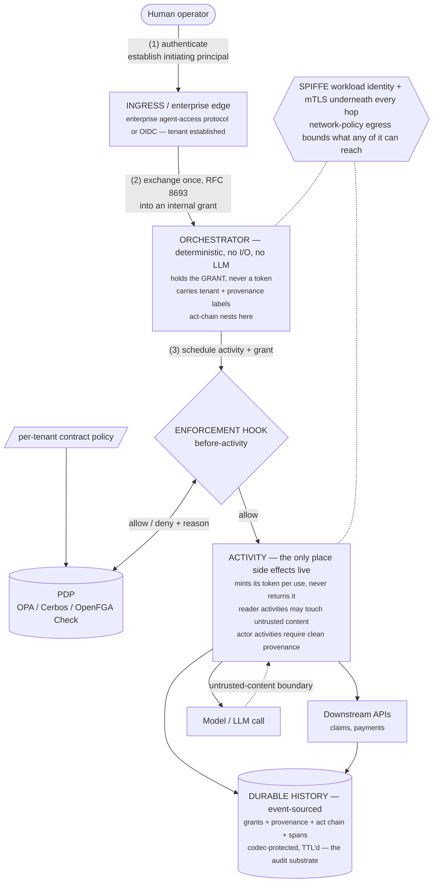
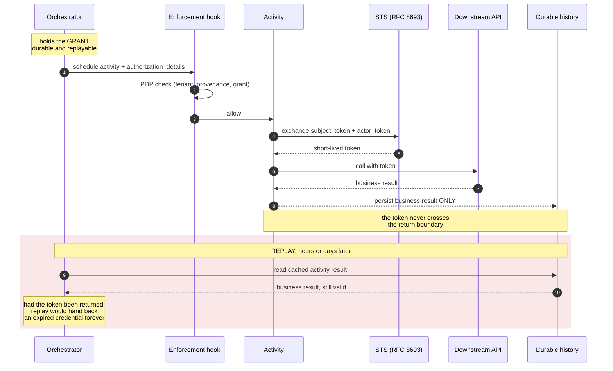
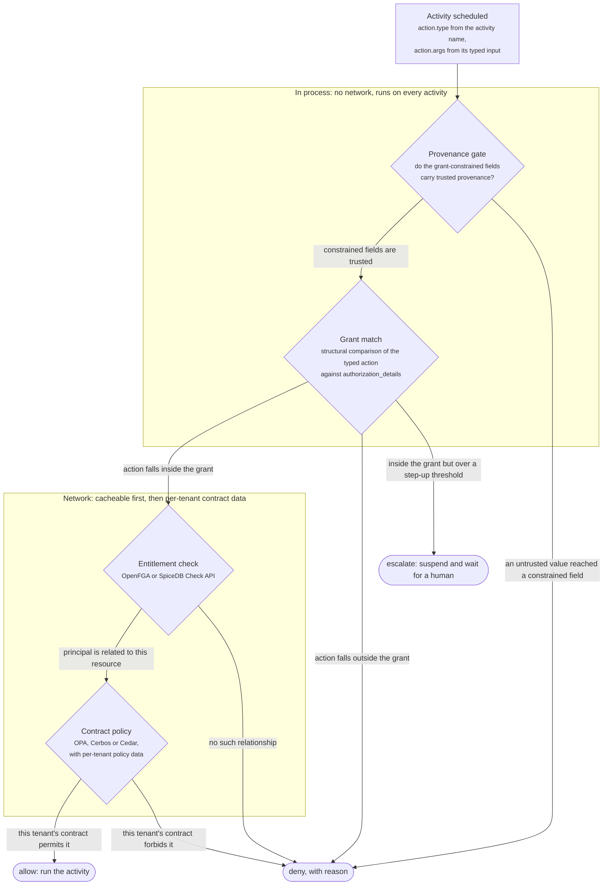
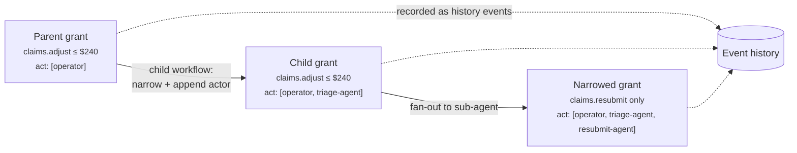
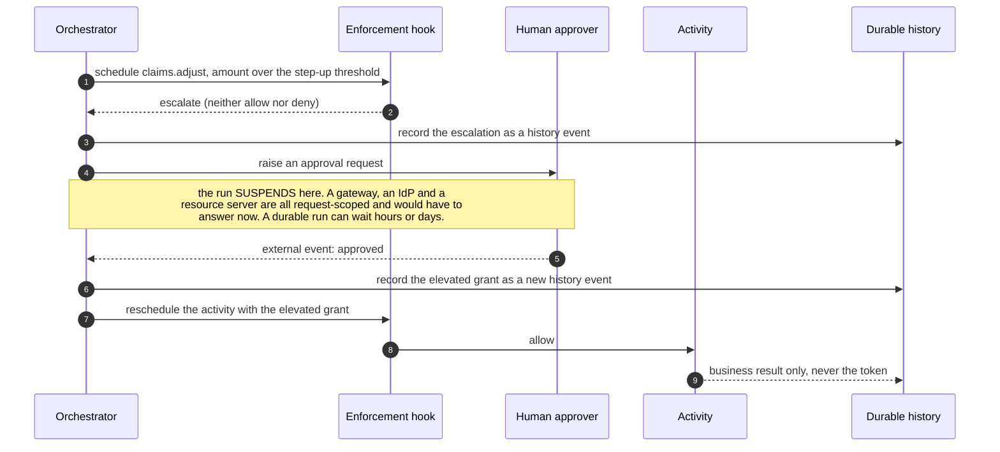
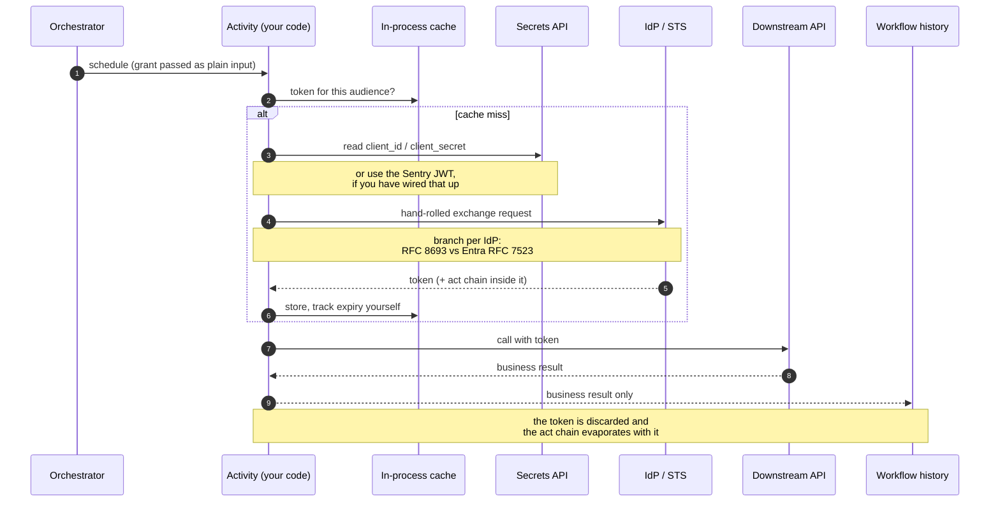

# Multi-tenant agentic workflows: a worked reference architecture

*One concrete regulated multi-tenant use case driven out into layers, twelve named failure points, an honest inventory of what a durable-execution runtime covers today, and the mechanics of carrying a typed grant through a run. A design exercise, not a description of a system anyone has shipped.*

## Why work it out against a use case

Agent-authorization material accumulates as separate standards, mechanisms and surveys, each defensible on its own, none of which tells you what breaks. This document grounds all of it in one system and asks what actually fails.

Companions: [What actually implements RFC 8693 and RFC 9396](rfc-8693-and-9396-in-practice.md) covers what exists. [Typed grants and provenance in a durable execution engine](typed-grants-in-a-durable-engine.md) covers the design reasoning. [Typed intent, open intent, and the limits of agent authorization](typed-intent-and-containment.md) covers what the standards can and cannot decide.

## The use case

**A multi-tenant SaaS running payer-operations agents on claims and billing exceptions.**

- **Tenants** are health plans and provider organizations. Each has a **separately negotiated contract** governing which data classes may be accessed, which may be *combined*, how long results may be retained, and whether data may leave a region.
- **Human operators** triage exception queues and hand work to agents.
- **The work is deliberately mixed.** "Figure out why this claim denied" is open-ended investigation. "Adjust this claim by $240 and resubmit" is a typed transaction. **Both occur inside the same run**, which is what makes the use case worth studying.
- **Some actions move money** (adjustments, refunds), so PCI applies. **Everything touches PHI**, so HIPAA applies.
- **The audit requirement is the hard part:** an external reviewer must be able to reconstruct, for any output, who authorized it, which agent did what under whose authority, which data was touched, and what was combined to produce the answer.

This use case is chosen because it forces every hard property simultaneously: typed *and* open intent in one run, per-tenant policy variance that is not expressible as roles, PHI in durable history, money-moving actions needing escalation, and a whole-chain audit obligation. Any domain with those five properties would do; healthcare payer operations just makes all five unavoidable at once.

## The layers



Identity underneath all of it: SPIFFE workload identity per agent and per service, mTLS between them, and network-policy egress bounding what any of it can reach at all.

### Why the grant is durable and the token is not

The single most load-bearing rule in this design falls out of replay semantics rather than from security preference:



## Where the problems actually are

Twelve named failure points. Most are not solved by any product today.

### Tenancy and policy

- **P1 — The tenant label does not propagate.** Tenancy is enforced at ingress and then lost. Inside the run every downstream call is "the service," not "tenant A's run," so any activity querying a shared store can read across tenants unless every single query is hand-scoped. Tenancy has to be a **non-forgeable, propagated attribute of the run**, checked at every activity, not a door policy.
- **P2 — Contract variance is not RBAC.** Roles cannot express *"tenant A's contract forbids combining claims data with pharmacy data; tenant B's permits it."* That is a per-tenant policy document that changes on contract renegotiation, not on code deploy. It needs a PDP with per-tenant policy **data**, not rules compiled into the app.

### Provenance and grant integrity

- **P3 — The untrusted-content boundary is invisible.** Denial reasons, provider notes and remittance advice are not "trusted input" in the RFC 9396 sense, and nothing in a standard workflow marks which values came from there.
- **P4 — The grant gets built from the wrong inputs.** If an agent reads a denial reason and then constructs "adjust by $9,000," the grant is bound to attacker-supplied values. Orchestrator determinism proves the *orchestrator* did not fabricate them; it says nothing about how they arrived.

### Durability and credentials

- **P5 — PHI lands in durable history and outlives the run.** In Dapr specifically, **workflow actor state remains in the state store after completion**, which collides directly with contractual retention limits.
- **P6 — Tokens in history are a correctness bug, not just a leak.** Replay returns cached activity results without re-executing, so an activity that returns a token returns the same expired token forever.
- **P7 — Token lifetime versus workflow lifetime.** A claims investigation may pause for days awaiting a human or an external response. No access token survives that, so the durable artifact must be the grant.

### Audit

- **P8 — The audit trace is split across three systems.** Tokens live in IdP logs, spans in OpenTelemetry, business events in workflow history. The auditor's question spans all three and nothing joins them.
- **P9 — Synthesis has no provenance.** When an agent combines shared reference data with one tenant's PHI, nothing records which output derived from what. This is the fourth of the four traceability chains, and it has no standard at all.

### Escalation and delegation

- **P10 — Step-up authorization has no natural home.** *"This adjustment exceeds $5,000, require a human"* fits nowhere: not the token (already minted), not the model (untrusted), not the downstream API (lacks context). The activity boundary is the only place that knows enough.
- **P11 — Sub-agent delegation either loses the chain or over-grants.** Passing a token down is over-granting; re-delegating properly costs an STS round trip per hop.
- **P12 — Open-ended work has no grant to check.** "Figure out why this denied" is not a typed transaction. Containment, not authorization.

## What a durable runtime already covers

Taking Dapr as the worked example, because the gap is narrower than the usual telling. Status as of 2026-08-31.

| Capability | Status | Helps with |
| --- | --- | --- |
| SPIFFE identity, on-by-default mTLS, spoof-proof invocation ACLs | Shipping | P1 partially — identity is non-forgeable, but *tenancy* is not the identity |
| **Sentry JWT + OIDC discovery (v1.16)** | Shipping | P11 — gives an RFC 8693 exchange a real `subject_token`/`actor_token` |
| Workflow orchestrator determinism | Shipping | P4, structurally |
| Event-sourced history | Shipping | P8 — the best single audit substrate available, though it holds only one of the three streams |
| State-store encryption (AES-GCM, primary/secondary keys) | Shipping | P5 partially — all-or-nothing per store |
| OPA middleware; **argument- and tool-aware** OPA policies for MCP, inspecting the JSON-RPC body | Shipping | P2, P10 — the enforcement *hook* already exists in-tree, and argument-level checking is structurally the same shape a typed grant needs |
| Actors (per-instance state isolation) | Shipping | P1, as a placement and memory-isolation primitive |
| Component model | Shipping | the swappability every item below depends on |

## What it would have to extend

Three tiers, ordered by whether anything else is possible without them.

**Tier 1 — prerequisites. There is no product here until these exist.**

1. **Payload codec hook, codec component type, and a decode endpoint contract.** The Temporal Codec Server shape: per-payload, pluggable, running before the payload reaches the state store, with a decode *service* so an operations console or CLI can render history **without the platform vendor ever holding a customer's PHI keys**. *(P5)*
2. **A hard rule that credentials never cross an activity return boundary**, ideally enforced by a runtime or lint check rather than by documentation. *(P6)*
3. **Grant as the durable artifact; tokens minted per use inside the activity.** *(P6, P7)*
4. **History TTL and purge controls** bound to retention contracts. *(P5)*
5. **Failure and stack-trace scrubbing** — Temporal names this exposure explicitly and other engines should assume they share it. *(P5)*

**Tier 2 — the actual feature.**

6. **`authorization_details` as a first-class workflow and activity value**, attachable at schedule time. *(P4, P10)*
7. **A before-activity enforcement hook** calling a PDP. *(P2, P10)*
8. **A `policy` building block** abstracting the *question* (`check(principal, action, resource, context, grant) → allow | deny + reason`) across OPA, Cerbos, Cedar and Zanzibar Check APIs, **without** abstracting relationship writes. *(P2)*
9. **An STS component type** (`sts.keycloak`, `sts.zitadel`, `sts.auth0`) implementing RFC 8693 behind one interface. *(P11)*
10. **Automatic grant narrowing and `act`-chain nesting** on child workflows and fan-out. *(P11)*
11. **Tenant as a first-class, propagated, non-forgeable run attribute.** *(P1)*

**Tier 3 — the differentiator, and the hardest.**

12. **Provenance labels on activity inputs and outputs**, propagated through the data plane and persisted alongside values. *(P3)*
13. **Reader versus actor activity classification** — the quarantined/privileged split from CaMeL-style designs expressed as activity metadata rather than as two models. *(P3, P12)*
14. **Provenance-keyed policy**, so a decision can turn on where a value came from rather than only on who is asking. *(P3, P4)*
15. **The trace join** — binding the `act` chain, the OpenTelemetry span and the history event into one queryable record. Nothing does this, and it is what the four-chain audit requirement actually needs. *(P8, P9)*

Of these fifteen, only item 9 has been worked up as a fileable proposal; see [Proposal: Delegated Identity and Token Exchange in Dapr](dapr-delegated-identity-proposal.md) for why that one and not the other fourteen.

## The typed grant in detail

The gap statement is narrow and precise: **a typed, per-transaction grant carried through a workflow and enforced at the activity boundary.** This section works out what that means mechanically.

### The grant object

Constructed at ingress from **trusted** input (the case record, the operator's action, the contract), never from model output. RFC 9396 shaped:

```json
[{
  "type": "claims.adjust",
  "locations": ["https://claims-api.internal"],
  "actions": ["adjust", "resubmit"],
  "identifier": { "claimId": "C-4821", "tenantId": "acme-health" },
  "privileges": { "maxAmountCents": 24000 }
}]
```

It rides as a **first-class field on the workflow instance, separate from the business payload**, for four reasons: it must be tamper-evident, survive replay, be narrowable per child, and be separable for audit. Grant issuance and narrowing are recorded as their own **history event types**, which is what turns the audit chain from a logging discipline into a property of the run.

### Three questions, three engines

The decision at an activity boundary looks like one question and is actually three. Conflating them is why "just use OPA" and "just use OpenFGA" are both wrong answers.

| # | Question | Nature | Where it belongs |
| --- | --- | --- | --- |
| 1 | **Does the action match the grant?** | Structural comparison of a typed action against a constraint object. Comparing `amountCents: 24000` against `maxAmountCents: 24000` is arithmetic, not policy. | **Built into the runtime.** Generic, local, no network. This is the piece a workflow engine can ship that nobody else can. |
| 2 | **Is this principal entitled to this resource at all?** | Relationship. *Is this operator assigned to acme-health? Is claim C-4821 in acme-health?* | **OpenFGA or SpiceDB**, via a Check call. |
| 3 | **Does the tenant's contract permit this action on this data class right now?** | Attribute and context policy that changes on contract renegotiation, not deploy. | **OPA, Cerbos or Cedar**, with per-tenant policy data. |

Plus a provenance gate, below, which is local and cheap.

**The ordering is a real engineering decision, not an implementation detail.** Run them cheapest-and-most-local first, because this happens on *every activity*: provenance check and grant match are in-process with no network; the ReBAC Check is a cacheable network call; contract policy is a network call needing tenant policy data. Failing fast on the free checks is what makes per-activity enforcement affordable.

*Component view, zooming into the ENFORCEMENT HOOK box of the layers diagram above: in what order do the gates run, and which of them cost a network call?*



**Key.** The two boxed zones group gates by cost, not by ownership: everything in the upper zone is in-process and free, everything in the lower zone is a network call. Diamonds are decision points, rounded boxes are terminal outcomes. Reading top to bottom is the required execution order.

The decision request the runtime assembles:

```json
{
  "principal": { "sub": "operator:jdoe",
                 "act": [{ "sub": "spiffe://…/ns/agents/triage-agent" }] },
  "tenant":    "acme-health",
  "action":    { "type": "claims.adjust",
                 "args": { "claimId": "C-4821", "amountCents": 24000 } },
  "grant":     [ /* authorization_details in scope */ ],
  "provenance":{ "amountCents": "trusted:case-record",
                 "reason":      "untrusted:denial-text" },
  "context":   { "workflowId": "…", "step": 12, "parentGrant": "…" }
}
```

Note what makes this assemblable at all: **the activity name supplies `action.type` and the activity's typed input supplies `action.args`.** No developer annotation is required for the common case.

### Where provenance plugs in

RFC 9396's binding is only as good as the values bound. Anyone building on it has to hold one non-negotiable condition: the grant's constraint values must come from a trusted source and never be assembled by the agent out of the same untrusted content it is reading. Provenance labels mechanize that condition instead of merely asserting it. Two distinct gates:

- **Grant-construction gate** — every value inside a grant must have trusted provenance. Checked when a grant is issued or narrowed. This is the difference between *"the orchestrator is deterministic so the values must be fine"* (a structural argument with a hole in it) and *"this `amountCents` is tagged `trusted:case-record`"* (a checkable fact).
- **Argument gate** — arguments to an *actor* activity must have trusted provenance for whichever fields the grant constrains. A `reason` field carrying untrusted denial text is fine; an `amountCents` derived from it is not.

### Narrowing and delegation



Two rules, both **provable rather than policy**, so the engine can enforce them generically: a child's grant must be a **subset** of its parent's, and the `act` chain **appends** the child's identity rather than replacing it. Subset checking over a constraint object is mechanical. Every narrowing is a history event, which is how the delegation chain ends up in the same record as the business process instead of only in the IdP's logs.

### Step-up: the outcome only a durable engine can offer

The grant match should return **three** outcomes, not two: `allow`, `deny`, and **`escalate`**.

This is where durable execution has an advantage that is not rhetorical. P10 said step-up authorization has no natural home, and the reason is that **every other layer in the stack is request-scoped**: a gateway, an IdP and a resource server all have to answer *now*. A durable workflow can wait. So `escalate` suspends the workflow on an external event, a human approves hours later, and the run resumes with an elevated grant recorded as a new history event.

*Dynamic view, container level, of a **proposed** third outcome that no engine implements today: what happens between the escalate decision and the run resuming?*



Waiting for a human is a thing workflow engines are already excellent at. Step-up authorization turns out to be a durable-execution-shaped problem that has been living in the wrong layer.

## Current state: how a durable workflow does this today

There is no built-in path in Dapr as of 1.18. **Token acquisition and delegation are entirely application code, executed inside an activity.** Worth stating plainly, because a proposal without an honest baseline is a pitch.



**What you write yourself, step by step:**

1. **Get an identity to exchange.** Either the v1.16 Sentry JWT, or, far more commonly in existing code, a `client_id`/`client_secret` read through the secrets building block. The second path is a configured string rather than an attested fact, and it is what most applications do today.
2. **Perform the exchange in application code.** `grant_type=urn:ietf:params:oauth:grant-type:token-exchange` with `subject_token`, `subject_token_type`, optional `actor_token`, and `audience`. Many OAuth client libraries do not implement RFC 8693 at all, so this is frequently hand-rolled HTTP, **and it branches per IdP** because Entra needs RFC 7523 with `requested_token_use=on_behalf_of` instead.
3. **Do it inside an activity, never the orchestrator.** It is I/O and non-deterministic.
4. **Use the token inside that same activity and never return it.** So the practical shape is one activity that exchanges *and* calls the downstream service together, which means **token acquisition is not reusable across activities** unless you build a cache.
5. **Cache in worker process memory**, because the token cannot go in workflow state. Consequences: the cache is per-worker rather than per-workflow, a workflow that resumes on a different worker starts cold, and nothing about the exchange appears in workflow history.
6. **Propagate to child workflows by hand.** Nothing carries automatically. You construct the narrower grant yourself, pass it as child input, and the child's activities each redo their own exchange.

**Four things that hurt in practice:**

- **Per-IdP branching** duplicated across every application and every language.
- **The workload credential is handled by application code**, which is the thing SPIFFE identity was supposed to stop.
- **The caching layer is rebuilt each time**, with expiry and refresh logic that is easy to get subtly wrong.
- **The delegation chain evaporates.** The `act` claim exists inside a token that gets discarded at the end of the activity, so the chain survives only in the IdP's logs and the downstream service's logs, never in the workflow history that holds the rest of the business record. This is P8 and P11 made concrete.

### The mitigation worth knowing: persist the claims, not the token

The audit gap is closable today without any platform change. After the exchange, inside the activity, parse the token and record its **claims** as part of the activity's business result: `sub`, the nested `act` chain, `aud`, `scope`, `jti`, `iat`, `exp`, and `authorization_details` when present. Never the token itself.

That buys the delegation chain inside workflow history, a `jti` that correlates to the IdP's own logs, and no credential in durable storage. The distinction underneath it generalizes:

> **A claim record is a fact. A token is a capability. Facts replay correctly; capabilities do not.**

**What a platform change would and would not remove.** It removes plumbing: the per-IdP branching, application handling of the workload credential, and the caching layer. It does **not** remove the grant semantics, the enforcement decision, or the claims-persistence discipline, all of which stay application concerns either way. That is a deliberately modest claim and it is what makes the proposal credible.

**The credential is in the right place and there is no supported way to spend it.** Dapr's Sentry returns per-audience JWTs inside the `SignCertificateResponse` during certificate signing, and exposes OIDC discovery and JWKS on its OIDC HTTP port. The documented use case is federating to Entra via a Federated Identity Credential bound to the SPIFFE ID.

There is no application-facing API for retrieving that JWT. As of `dapr/dapr` v1.18, `FetchJWT(ctx, audience)` is declared on the internal `Handler` interface at `pkg/security/security.go:67` and implemented at `:504`, delegating to `jwtSource.FetchJWTSVID`. Its only production consumer is `pkg/runtime/mcp/auth/auth.go:255`, an HTTP round-tripper that *attaches* the token to outbound MCP calls; everything else referencing it is a test or a fake. It is unexported Go API under `pkg/`. A search across `dapr/proto` returns exactly one JWT-bearing proto — the sidecar-to-Sentry certificate-signing exchange, not an app-to-sidecar API — and `dapr/go-sdk` has zero matches for JWT.

So the sidecar can obtain and attach a Sentry-issued JWT-SVID, and the application cannot ask for one. That strengthens the case rather than weakening it: the credential already sits in the right place, and the missing piece is a way to spend it.

## What stays application-specific regardless

- **The grant predicate semantics.** A generic matcher gets most of the way once the activity name is the RAR `type`, but domain meaning is yours.
- **The per-tenant contract policies themselves** — the data, not the engine.
- **The taint lattice for your domain**: deciding what counts as trusted, and what declassification is permitted.
- **Synthesis-chain semantics**, since no standard defines them.

## What would falsify this design

Stated up front, because a reference architecture that cannot be wrong is not useful:

- **Activity-granularity taint may be too coarse.** One tainted input contaminates a whole activity result. If activities are large, everything ends up tainted and the signal dies.
- **Per-activity PDP calls add latency** to every step of every run. Whether that is acceptable is an empirical question nobody here has measured.
- **Policy-authoring burden is real and ongoing** — the CaMeL authors say so about their own system, and per-tenant contract policies multiply it.
- **The typed-grant story collapses if activities are not meaningfully typed.** An activity declared `run_agent(prompt: string)` is nominally typed and semantically open, and no grant can bind to it. The forcing function only works if the decomposition is real.

## Related documents in this repository

- [What actually implements RFC 8693 and RFC 9396](rfc-8693-and-9396-in-practice.md)
- [Typed grants and provenance in a durable execution engine](typed-grants-in-a-durable-engine.md)
- [Typed intent, open intent, and the limits of agent authorization](typed-intent-and-containment.md)
- [Proposal: Delegated Identity and Token Exchange in Dapr](dapr-delegated-identity-proposal.md)
- [Dapr Workflow vs. Temporal: where the gaps actually are](dapr-workflow-vs-temporal.md)
