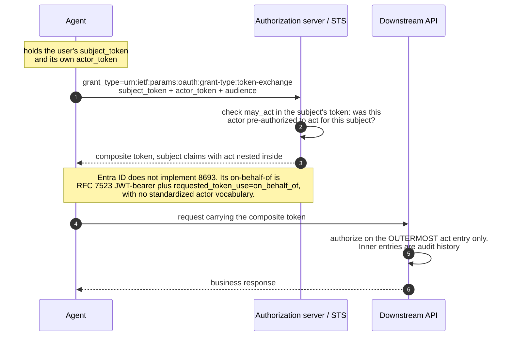
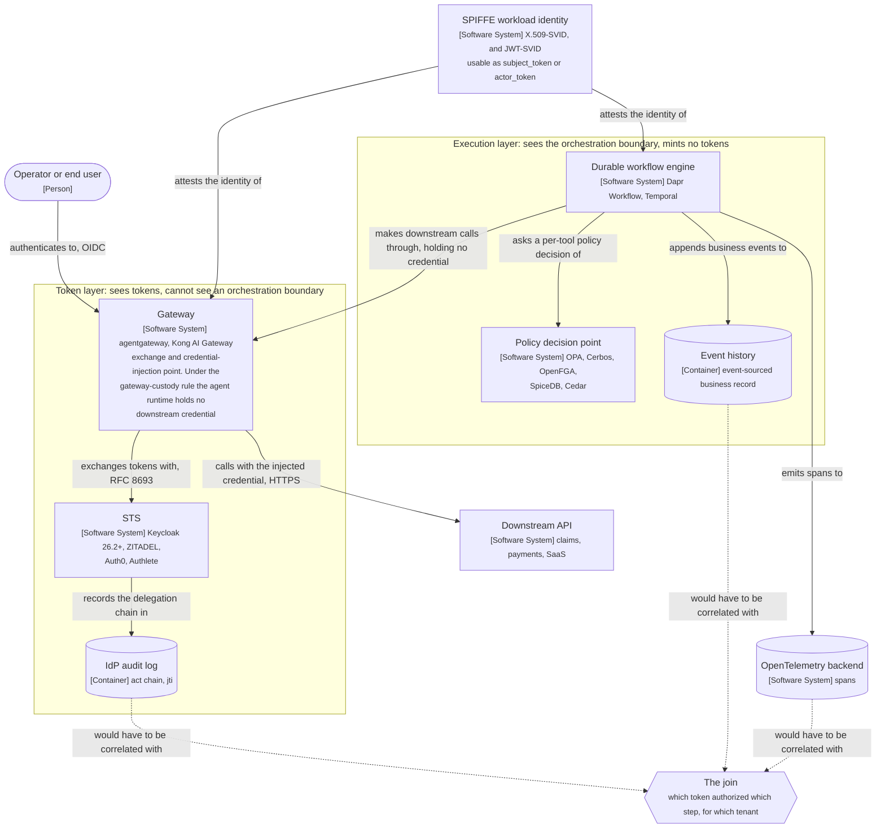

# What actually implements RFC 8693 and RFC 9396

*An implementation survey, as of 2026-08-31, of OAuth token exchange and rich authorization requests: one half is a shipping commodity, the other is a ratified standard almost nobody has deployed, and nothing ships the join between them.*

## The question

If you were building a multi-tenant agentic system that had to silo tenant data and keep full traceability through the entire call chain, do the tools exist?

Short version: **the identity and delegation halves are commodity; the typed-grant half is not; and nothing ships the join between them.**

Stated more sharply: **RFC 8693 token exchange is a solved, shipping commodity. RFC 9396 Rich Authorization Requests is a ratified standard that almost nobody has deployed outside two niches.** Anyone claiming a complete agent-authorization product in 2026 is either doing open banking, or is doing the easy half.

Everything below reflects public documentation as of **2026-08-31**, with no visibility into any vendor's roadmap. Adoption figures in particular move fast; treat them as dated observations rather than current state.

## RFC 8693 (token exchange): broadly available

[RFC 8693](https://www.rfc-editor.org/rfc/rfc8693.html) (Standards Track, January 2020) defines the extension grant `urn:ietf:params:oauth:grant-type:token-exchange`, which turns an authorization server into an HTTP/JSON Security Token Service: present a `subject_token`, get back a different token shaped for somewhere else. Optionally present an `actor_token` as well, and the authorization server can issue a composite token carrying an `act` (actor) claim nested inside the subject's claims. That is the delegation case, and it is exactly the shape of "an agent acting for a user."

| Product | Status |
| --- | --- |
| **Keycloak** | Standard token exchange RFC-compliant and officially supported as of **26.2** (released April 2025; the supported-status announcement is May 2025), though scoped at that point to internal-token-to-internal-token — brokering and impersonation were still listed as planned. **26.5** (Jan 2026) adds the JWT Authorization Grant (RFC 7523) plus **identity chaining**, preserving the original user identity and claims through the chain; the grant shipped as preview in 26.5 and reached supported status in 26.6 (April 2026). |
| **ZITADEL** | Native; exchanges scope, audience or subject, including opaque-token to JWT. |
| **Authlete** | Supported from **2.3** onward. |
| **Auth0 / Okta** | Supported. |
| **Gateways** | The enforcement pattern is mature: agentgateway uses 8693 as its **default** grant; the same shape appears in Kong, Istio-style meshes, and Spring Cloud Gateway. |
| **Microsoft Entra ID** | **Does not implement 8693.** Its on-behalf-of flow is RFC 7523 JWT-bearer plus a non-standard `requested_token_use=on_behalf_of`, with no standardized actor-claim vocabulary. Delegation-shaped, not 8693-compliant. Every gateway special-cases it. |

The Entra divergence is worth being precise about, because it is the single most common integration tax in this area. Both are OAuth extension grants that consume an inbound JWT and mint a new bearer token, so they reach the same practical outcome. They are not interchangeable: 8693 has a `subject_token`/`actor_token` split with explicit `act` and `may_act` claims that make delegation machine-legible **in the issued token itself**, whereas on-behalf-of carries the inbound token in an `assertion` parameter with no equivalent standardized actor vocabulary. A client written against 8693's request shape will not work unmodified against Entra.

Two 8693 claims carry the delegation chain:

- **`act`** nests to record the chain. **Only the outermost actor is access-control relevant**; inner ones are audit history.
- **`may_act`** lets a subject's own token pre-authorize a specific party to act for it, so the authorization server can check that a delegation was actually sanctioned rather than trusting the caller's say-so.

*Dynamic view, container level: what does an RFC 8693 exchange actually move, and where does the delegation chain end up?*

Public gateway implementations show the same three-grant shape in practice — 8693 token exchange as the default, RFC 7523 JWT-bearer as the second, and Entra on-behalf-of folded in as a vendor dialect of the second, with the vendor-specific `requested_token_use` parameter passed through as an additional parameter.

## RFC 9396 (RAR): ratified, largely undeployed

[RFC 9396](https://www.rfc-editor.org/rfc/rfc9396.html) (Standards Track, May 2023) adds the `authorization_details` request/response parameter: a JSON array of typed objects replacing or supplementing OAuth's space-delimited `scope` string. Each object carries a required `type` plus RFC-defined common fields any API can reuse — `locations`, `actions`, `datatypes`, `identifier`, `privileges`. So instead of "may issue refunds," a grant can say "may issue a refund, for ticket 4821, up to two hundred dollars, on this one account."

Three details from the spec matter for anything built on it:

- **Fields inside one object form a Cartesian product.** Multiple objects of the same `type` are how a client requests disjoint action/datatype pairs that the product would otherwise conflate (read contacts plus write photos, without accidentally granting write contacts).
- **The token response echoes back what was granted**, which may be *narrower* than requested (the user declined some) or **enriched** (the authorization server fills in details the client did not know at request time, such as which account the user selected during consent).
- **There is no standard comparison algorithm.** RFC 9396 explicitly declines to define how to compare two `authorization_details` requests, because whether `write` subsumes `read` is type-specific. Each `type` definition owns that.

### The adoption datum

From a metadata survey run **2026-08-03**: of **20 public authorization servers checked, 19 reachable, zero advertised `authorization_details_types_supported`** in discovery. The same null result held for `pushed_authorization_request_endpoint` (RFC 9126) and `dpop_signing_alg_values_supported` (RFC 9449). Servers checked: Google, Microsoft Entra ID, Apple, Salesforce, GitLab, Atlassian, Slack, Twitch, Yahoo, PayPal, Spotify, ORCID, Login.gov, GOV.UK One Login, NHS login, Zoom, Dropbox, Xero.

> **Method, so this is reproducible.** Each server's OAuth 2.0 Authorization Server Metadata document (RFC 8414) was fetched from its published discovery endpoint — `/.well-known/oauth-authorization-server` or `/.well-known/openid-configuration` — and the returned JSON was checked for the three keys named above. Selection was by convenience rather than by any sampling frame: large consumer and enterprise identity providers, plus the public-sector services, chosen because their metadata is public and unauthenticated. One of the twenty did not return a document and is excluded from the denominator.
>
> Two limits are worth stating, because they bound what the null result means. Discovery metadata advertises support; a server could implement RAR without announcing it, so this measures *declared* support rather than capability. And a convenience sample of large general-purpose providers is precisely where RAR adoption would be expected to lag — the open-banking and OID4VCI deployments where RAR *is* used are mostly not in this list, by construction. The finding is that RAR is absent from the mainstream discovery surface, not that no deployment exists. Re-running it is a few lines of `curl` and `jq` against the same eighteen names.

**Read that caveat honestly, because it cuts the other way too.** The sample is *biased against RAR by construction*. The deployments known to use RFC 9396 are open-banking and identity-wallet ecosystems whose authorization servers sit behind registration and are not publicly discoverable. Absence from public discovery is not proof of absence.

### Where RAR is real

- **OpenID for Verifiable Credential Issuance 1.0** (Final, 2025-09-16) **requires** the authorization details type `openid_credential`. This is shipped, mandated RAR.
- **Payments and open banking**, the origin domain and still the centre of gravity.
- **Auth0** is the only commercial authorization server *named* in Dan Moore's 2026-03-30 article as having added native RAR support; the article itself says "Auth0 and other major identity providers have added native support for RAR," so it is evidence of adoption, not of exclusivity.

### Two structural gotchas for anyone planning to build on it

- **The spec deliberately leaves resource-server enforcement to you.** A RAR-capable authorization server issues the grant; *checking it before the action executes is your code*. This is the part people assume they are buying and are not.
- **Pair it with PAR (RFC 9126).** `authorization_details` payloads get large, and URL-encoding a complex JSON array into a GET parameter is a problem. RAR also travels the front channel through the user agent, so integrity matters when the payload is sensitive — and the RFC's own worked examples are full of IBANs, patient IDs and taxpayer IDs. PAR is also barely advertised publicly.

### Agent-specific extension work is early and narrow

[`draft-chen-oauth-rar-agent-extensions`](https://datatracker.ietf.org/doc/html/draft-chen-oauth-rar-agent-extensions-00) (Meiling Chen, Li Su, China Mobile; 2026-02-04) is an **individual draft, not IETF-endorsed**, and it expired on 2026-08-08. It adds two members to `authorization_details`:

- `policy_context` — request authorization under a named assurance level (for example `financial_grade_v1`), with optional `compliance_frameworks`, targeting policy-downgrade attacks.
- `lifecycle_binding` — tie grant validity to external task state via a `task_status_webhook` with `task_id` and `termination_states`, targeting over-long permission lifetimes and specifically "long-running tasks retain valid tokens after completion."

Notably it does **not** address delegation chains, multi-agent traceability, or on-behalf-of. Separately, RAR support was requested in the Model Context Protocol ([issue #1670](https://github.com/modelcontextprotocol/modelcontextprotocol/issues/1670), opened 2025-10-17) and the issue was closed — which strengthens rather than weakens the point below: RAR was asked for in the venue where agent authorization is being standardized, and was not adopted.

## What full traceability actually demands

The most precise statement of the requirement comes from *Authorization Propagation in Multi-Agent AI Systems: Identity Governance as Infrastructure* (Krti Tallam, arXiv preprint, May 2026, [2605.05440](https://arxiv.org/pdf/2605.05440)). To be traceable, a system must be able to reconstruct **four things a traceable system must reconstruct**:

1. **The initiating principal** and their authorization state at workflow initiation.
2. **The delegation chain** — which agent delegated to which, with what authority transfer.
3. **The data access chain** — which agent accessed which resource, under what authorization, at what time.
4. **The synthesis chain** — which results were combined by which agent to produce the final output.

An independent reviewer must then be able to inspect the trace and determine whether each access was authorized *at the time it occurred*, whether the delegation chain was valid, whether the aggregation of accesses stayed within policy, and whether the final result was authorized for delivery.

The paper surveys emerging agentic platforms and finds **none comprehensively implements this**, naming standardized agent delegation semantics, formal verification of authorization chains, and consistent tenant isolation across tool boundaries as missing. *(Preprint, single author, not peer-reviewed. Treat the four-chain framing as a useful requirements checklist rather than a settled standard.)*

Note that chain 4 has no standards support at all. `act` claims record delegation, not *synthesis*.

## Multi-tenant siloing is architecture, not a product gap

The isolation axis is a well-trodden spectrum rather than a tooling gap:

- **Fully siloed** — per-tenant infrastructure, separate vector stores and object storage. Best isolation, worst cost.
- **Fully pooled** — shared resources with logical separation in software. Cheapest, scales best, and every leak is one bug away.
- **WSO2's Cells as the Containment Unit for Agentic Systems** ([reference-architecture repo](https://github.com/wso2/reference-architecture/blob/master/cells-as-the-containment-unit-for-agentic-systems.md), Asanka Abeysinghe et al., 2026) is the most developed *architectural* reference: an eight-layer "agentic cell," four independently-enforced gateway edges, three identity types (user, agent, on-behalf-of delegation) chained into an auditable actor chain via RFC 8693, and the rule that **the gateway, never the agent runtime, holds downstream credentials**. Google Cloud also publishes a multi-tenant agentic AI reference architecture.

The WSO2 paper is worth reading as convergent evidence rather than as another vendor pitch: an enterprise-architecture team applying an existing gateway-custody pattern to agents lands on the same "the gateway holds the secret, the agent never does" rule that AI-infrastructure vendors reached from the runtime-isolation side.

## Where a workload-identity runtime already fits

A common assumption is that a distributed-application runtime with strong workload identity has the identity half and none of the authorization half. Taking Dapr as the worked example, that framing is out of date in a way that matters:

- **SPIFFE identity** — Sentry issues X.509-SVIDs bound to `spiffe://<trust-domain>/ns/<namespace>/<app-id>`, on-by-default sidecar mTLS, and spoof-proof service-invocation ACLs derived from the App ID.
- **Dapr 1.16 (2025-09) added JWT issuance and OIDC discovery to Sentry.** Sentry can issue JWTs alongside the X.509 SVIDs and expose `/.well-known/openid-configuration` and `/jwks.json`. That makes the runtime an **OIDC issuer for workloads**: Entra ID, AWS IAM and GCP Workload Identity can be configured as relying parties validating runtime-issued tokens, federated on the app's SPIFFE ID (on Kubernetes via a `dapr.io/sentry-request-jwt-audiences` annotation).
- **Authorization primitives already exist, and are less coarse than usually assumed**: service-invocation allowlists by App ID; for MCP, App-ID gating **plus an OPA per-tool policy layer doing "argument- and tool-aware authorization that inspects the MCP JSON-RPC body,"** with the `MCPServer` resource supporting "argument-level RBAC, audit, or redaction hooks on a per-tool basis" (verified against `docs.dapr.io/developing-ai/mcp`, 2026-08-31); and OAuth 2.0 bearer validation as inbound HTTP middleware.

**Why the OIDC issuance matters for this question:** an OIDC-verifiable JWT bound to a workload's SPIFFE ID is exactly what an RFC 8693 exchange consumes as `subject_token` or `actor_token`. Such a runtime can therefore already be the *identity input* to an external STS (Keycloak, ZITADEL, Auth0, Authlete), which is the bridge many assume is missing.

**What is still genuinely absent** is narrower and more precise than "the runtime has no authorization": there is no **typed, per-transaction grant carried through the workflow and enforced at the activity boundary**. That is missing nearly everywhere, not in one engine.

## Open-source coverage, by layer

| Layer | OSS status |
| --- | --- |
| RFC 8693 exchange | **Solved and free.** Keycloak (26.2+, identity chaining in 26.5), ZITADEL. |
| Policy decision | **Solved, five mature choices.** OPA, Cerbos, OpenFGA, SpiceDB, Permify, plus AWS Cedar. Scale datapoint: per [AuthZed's own customer story](https://authzed.com/customers/openai), SpiceDB backs fine-grained access control over 37 billion+ documents for roughly 5 million business users across ChatGPT's connectors. |
| Gateway / credential injection | agentgateway, Kong AI Gateway. |
| RFC 9396 issuance | Thin (see above). |
| RFC 9396 **enforcement** | **Nothing, by design of the spec.** |
| Taint tracking | **Research stage.** The CaMeL reference implementation, a TypeScript reimplementation with a taint-tracking tool wrapper and before-tool-call policy hook, and a proposal to adopt CaMeL in the OpenClaw agent runtime ([issue #39160](https://github.com/openclaw/openclaw/issues/39160), opened 2026-03-07), closed as not planned. Adjacent 2026 work: *Tracking Capabilities for Safer Agents* ([arXiv 2603.00991](https://arxiv.org/html/2603.00991v2)), MiniScope and AgentBound (least-privilege for tool-calling agents), NeuroTaint, Agent-Sentry, and a survey of execution provenance in LLM agents ([arXiv 2606.04990](https://arxiv.org/html/2606.04990)). |
| Token/provenance join | **Nothing.** |

## Is any of this inherently custom software?

A layered answer, because the parts differ:

- **The "who" half is not custom.** Commodity, open source, assembled with configuration.
- **The policy engine is not custom.** Pick one of five.
- **RFC 9396 enforcement is custom *by specification*.** The RFC assigns resource-server enforcement to the implementer, because deciding whether an action matches a grant requires knowing the action's semantics. **But that reasoning holds for a *generic* resource server and not for a workflow engine** — an engine knows exactly where the action boundary is, so it can ship the enforcement *hook*, the grant plumbing, and the narrowing rules generically even though the matching predicate stays application code. That distinction is worked out in [Typed grants and provenance in a durable execution engine](typed-grants-in-a-durable-engine.md).
- **Taint tracking is custom today**, though activity-granularity taint is tractable as a platform feature in a way value-granularity taint is not.
- **The join between the token-layer delegation chain and execution-layer provenance is custom, and is the actual gap.**

## The identity vendors arrived in 2026, on the "who" half

- **Okta Agent SSO went GA 2026-08-24**, registering agents as first-class identities in Universal Directory and issuing short-lived governed tokens in place of static API keys. It is included in core Okta SSO plans at no extra cost.
- **Cross App Access (XAA)** — Okta's OAuth extension for agent and app-to-app access — has been **formally incorporated as the Enterprise-Managed Authorization extension for MCP**, with 25+ launch partners including Anthropic, Cloudflare, Datadog, Figma and Zoom. **Auth0** entered XAA early access at the end of July 2026. It is not, however, the only commercial authorization server with native RAR support — Authlete, Curity and SecureAuth all document it, and Keycloak supports it.

The nuance that matters: XAA and Agent SSO operate at the **IdP layer**, governing agent-to-app access. They are not typed grants enforced *inside* a durable execution boundary, and an IdP cannot see an orchestration boundary. What they do settle is that "agents need real identity" has stopped being a differentiator and become table stakes.

On the durable-execution side, **Temporal** is *ahead on the prerequisite* — payload codec machinery for keeping credentials out of readable history, covered in [Dapr Workflow vs. Temporal](dapr-workflow-vs-temporal.md) — and, as far as this survey found, **level on the actual feature**: no typed-grant propagation or authorization-aware activity boundary in either engine.

## The honest bottom line

You can assemble roughly 70% of this today from shipping parts: SPIFFE for workload identity, Keycloak or ZITADEL as the 8693 STS, a gateway as the exchange and credential-injection point, OPA for per-tool policy, cell or namespace isolation for tenancy, OpenTelemetry for spans.

Three things you would be building yourself:

1. **RAR resource-server enforcement**, because the spec assigns it to you regardless of which authorization server you pick.
2. **The join between the token-layer delegation chain (`act`) and the execution-layer provenance** — which span, which workflow step, which tenant's data. Nothing joins these. The gateway sees tokens and cannot see the orchestration boundary; the workflow engine sees the orchestration boundary and does not mint tokens.
3. **Chain 4, synthesis provenance**, which has no standard at all.

*Container view of the assembled stack: which parts can be wired up from shipping products, and where is the seam that nothing joins?*

**Key.** Solid arrow: assemblable today from shipping, documented products. Dashed arrow and the hexagon: not implemented by anything surveyed here, and the second of the three custom items above. Cylinders are data stores; the rounded box is a person; the two boxed zones group elements by what they can observe, not by network or ownership boundary.

And the part no product solves because it is not a product problem: all of the above only binds **typed** intent. Open-ended agent work stays a containment problem, argued in [Typed intent, open intent, and the limits of agent authorization](typed-intent-and-containment.md).

## Related documents in this repository

- [Typed grants and provenance in a durable execution engine](typed-grants-in-a-durable-engine.md)
- [Multi-tenant agentic workflows: a worked reference architecture](multi-tenant-agentic-workflows.md)
- [Typed intent, open intent, and the limits of agent authorization](typed-intent-and-containment.md)
- [Proposal: Delegated Identity and Token Exchange in Dapr](dapr-delegated-identity-proposal.md)
