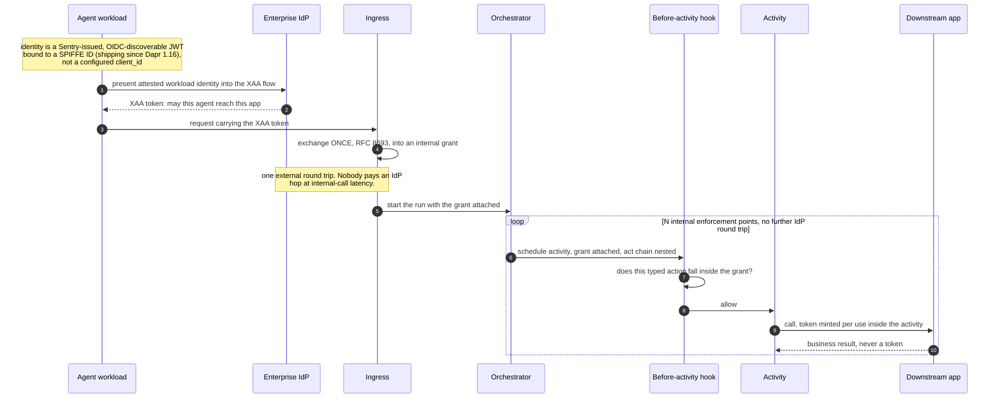
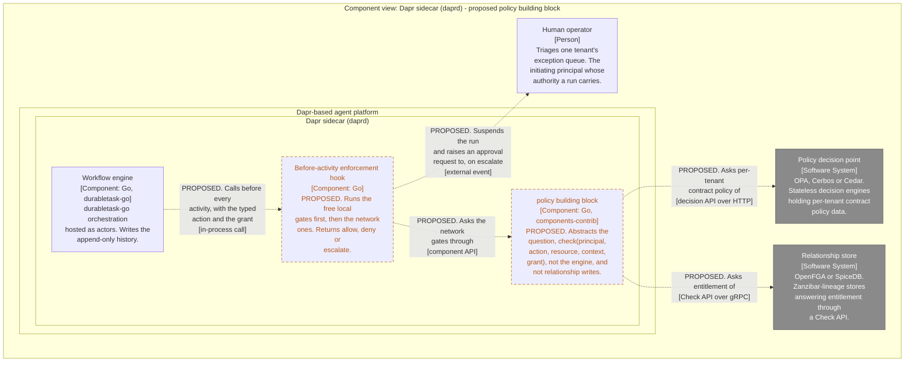

# Typed grants and provenance in a durable execution engine

*The design notes behind the delegated-identity proposal: why a workflow engine can package RFC 9396 enforcement when a generic resource server cannot, how a policy building block should abstract the question rather than the engine, and where an enterprise IdP protocol stops and the runtime has to take over.*

## What this is

[The delegated-identity proposal in this repository](dapr-delegated-identity-proposal.md) is the narrow, fileable version of an argument: add RFC 8693 token exchange as a first-class runtime capability, carry a non-secret delegation context across durable workflow boundaries, and resolve it to a token inside the sidecar at call time.

These are the exploratory notes that argument was cut down from. They cover three things the proposal deliberately dropped because they were out of its scope:

- how a typed-grant enforcement point composes with, rather than competes against, an enterprise IdP protocol like Okta's Cross App Access;
- how a `policy` building block should abstract two genuinely different policy paradigms (OPA-style decision engines and Zanzibar-style relationship stores) without collapsing into a lowest-common-denominator interface;
- why RFC 9396's decision to leave enforcement to the resource server does *not* mean enforcement cannot be productized — it means it cannot be productized *for a generic resource server*, which is a much weaker claim than it is usually read as.

Written against Dapr Workflow, but the reasoning applies to any log-based durable-execution engine: Temporal, Restate, DBOS, Azure Durable Functions. It is design reasoning, not a description of anything shipped. Implementation status of the underlying standards is surveyed in [What actually implements RFC 8693 and RFC 9396](rfc-8693-and-9396-in-practice.md).

## The prerequisite, stated once

The history-hygiene problem is worked out in detail in [Dapr Workflow vs. Temporal](dapr-workflow-vs-temporal.md) and is only summarized here, because everything below depends on it.

Event-sourced engines persist activity inputs **and outputs**, and two kinds of sensitive data end up there. They look alike and are not:

- **Business payloads** are an *encryption* problem. The data legitimately belongs in history and legitimately needs to be readable later by authorized parties. A pluggable payload codec with a key-free decode path for tooling is the right answer.
- **Tokens are not an encryption problem at all.** Replay returns cached activity results without re-executing them, so an activity that returns a token returns *the same* token on every replay. Encrypted or not, it is expired. **This is a correctness bug before it is a security bug.**

The rule that follows is forced by durable-execution semantics rather than chosen for hygiene:

> **A credential must never cross an activity boundary as a return value.** Mint it and use it inside the same activity; return only the business result. The durable artifact is the **grant**; the token is ephemeral and the orchestrator never sees one.

A corollary worth holding onto: because the orchestrator only ever handles grants, it stays in exactly the declarative, provenance-checkable world that a taint-tracking design wants it in, while credentials live entirely in the side-effecting layer.

One retention wrinkle specific to Dapr, since it changes what "purge" means: **workflow actor state remains in the state store after the workflow completes.** Whatever landed in history outlives the business process unless explicitly purged, which matters under a contract that limits how long you may hold a tenant's data.

## Composition with an enterprise IdP protocol

Okta's Cross App Access and Agent SSO govern agent-to-app access at the **IdP layer**, and XAA has been incorporated as the Enterprise-Managed Authorization extension for MCP. It is easy to read that as the whole problem being solved a layer up. The better read is composition, and it has two halves.

**Be the attestation underneath.** XAA decides which agent may reach which app, but that decision is only as trustworthy as the identity the agent asserts. An OAuth `client_id` is a configured string, not an attested fact — which is the substance of the public argument from the Dapr commercial side that agents need cryptographically attestable identity and that MCP gateways alone are not enough. A Sentry-issued, OIDC-discoverable JWT bound to a SPIFFE ID (available since Dapr 1.16, 2025-09) is a cryptographically attested **workload** identity that can be federated as the identity presented into an XAA flow. The runtime makes the thing the IdP governs non-forgeable.

**Terminate the enterprise protocol at the edge, carry delegation inward.** XAA is an enterprise-edge protocol; nobody will pay an IdP round trip per internal hop at internal-call latency. So accept the XAA token at ingress, exchange it **once** for an internal grant, then carry that grant through the run with `act` nesting and enforce it per activity. **One external round trip, N internal enforcement points.** That interior is structurally unavailable to an IdP, which cannot see an orchestration boundary.

*Dynamic view, container level, of a **proposed** design that nothing ships today: where does the enterprise IdP protocol stop, and what does the runtime take over?*

**Key.** Everything below the ingress line is proposed, not implemented: the attested workload JWT exists, the exchange-once-and-carry-inward path does not. Solid arrows are calls; the loop block marks the repeated interior.

The positioning line: *an enterprise IdP protocol answers "may this agent talk to Salesforce." The workflow engine answers "and across the twelve steps of the run that follows, which of them may touch what."*

## Abstracting OPA versus OpenFGA

If a durable engine is going to call a policy decision point before each activity, it needs an interface. The two dominant families are different paradigms, not two vendors of one thing:

- **OPA, Cerbos, Cedar** — stateless decision engines. Input is a context document, output is a decision. Policy-as-code.
- **OpenFGA, SpiceDB** (Zanzibar lineage) — stateful **relationship** stores. "Is user X a viewer of doc Y?" They own data; you write tuples into them.

A single building block spanning both is the classic lowest-common-denominator trap. The honest design is the one already applied to state stores:

- **Abstract the question, not the engine.** A `policy` building block whose contract is `check(principal, action, resource, context, grant) → allow | deny + reason`. That is native for OPA, Cerbos and Cedar, and a Zanzibar engine serves it perfectly well through its Check API.
- **Do not abstract the writes.** Tuple management is OpenFGA's native model and the exact analogue of Redis `INCR` in the state-store argument: the moment you need the engine's own model, take the direct dependency and own it. An abstraction over tuple writes is where this one stops paying.
- **Precedent already exists in-tree.** Dapr ships OPA as HTTP middleware and performs per-tool MCP authorization through OPA. What is missing is a component *interface* with several implementations rather than one hard-wired engine.

*Component view (C4 level 3) of the **proposed** policy building block: what the engine ships generically, and where the two policy paradigms attach to it.*

**Key.** Dashed orange borders and descriptions beginning **PROPOSED** mark components that do not exist. The two grey systems are the two paradigms the interface has to span, and they are separate boxes on purpose: one is a stateless decision engine, the other a relationship store whose writes this interface deliberately does not abstract. The escalate arrow to the human operator is the third outcome a request-scoped layer cannot offer.

Generated from [`docs/architecture/workspace.dsl`](docs/architecture/workspace.dsl), which is the single source for every C4 view in this repository; regenerate with `tools/build-diagrams.sh`.

The payoff is the usual one: the application declares that it needs a decision, and *which* PDP answers becomes a platform concern, so swapping Cerbos for OpenFGA is a YAML change instead of a rewrite.

## Why enforcement is packageable here but not in a generic resource server

RFC 9396 deliberately leaves enforcement to the resource server. This gets misread as *enforcement cannot be productized*. It is an argument about **where the semantics live**, mistaken for an argument about architecture.

The generic case is hard because an arbitrary HTTP API has an **unbounded action surface**. Nothing in the request says "this is an action of type T with parameters P," so a generic enforcement library must be told, endpoint by endpoint, what the action is. That work is the whole job and it does not generalize.

A durable workflow engine is different because it owns the call site:

> **In a durable workflow, the activity signature *is* the typed transaction.**

RAR needs a `type` plus type-specific fields. An activity has a **name** plus a **typed input schema**. Those are the same shape, so `type: "issue_refund"` with the constrained fields drawn from the activity's input is not an integration, it is an identity.

The engine can therefore ship generically:

- the grant object model and where it attaches;
- narrowing rules for child workflows and fan-out;
- `act`-chain nesting;
- the before-activity interception point;
- the audit binding into the same event history;
- per-use token minting.

What remains is the predicate — *does `issue_refund(ticket=4821, amount=200)` satisfy this grant?* — and once the activity name is the type and the input schema supplies the fields, that is a **generic matcher over a typed struct**, not bespoke code per endpoint.

### The consequence worth stating out loud

The standing objection to RFC 9396 for agents is that it only binds *typed* intent, and most agent work is open-ended. In a durable workflow, that constraint reads differently:

> **The fraction of a system you can express as typed transactions is exactly the fraction you have already decomposed into activities.** Durable-execution decomposition is itself a forcing function toward typed intent.

That reframes the constraint as a design practice rather than a ceiling. The discipline that makes a workflow durable — naming the steps, typing their inputs, isolating side effects into activities — is the same discipline that makes typed grants applicable to them. Whatever stays open-ended is precisely what you declined to express as an activity, and that is where containment takes over.

**The honest limit, which should be volunteered rather than waited for:** the mapping is only as good as the input schema is meaningful. An activity declared `run_agent(prompt: string)` is nominally typed and semantically open, and yields nothing to bind a grant to. The forcing function only works if the decomposition is real.

## Taint tracking at activity granularity

The other half of the design, and the harder one. Beyond identity and typed grants, a durable engine could carry provenance:

1. **Provenance labels on activity inputs and outputs**, propagated through the data plane and persisted in history alongside the values.
2. **Activity classification** — *reader* activities (may touch untrusted content, return data, take no side effect) versus *actor* activities (side effects, require clean provenance on their arguments). This is the quarantined/privileged split from CaMeL-style designs expressed as activity metadata rather than as two models.
3. **A policy hook keyed on provenance**, not only on identity.

**The granularity caveat decides feasibility.** CaMeL tags *every value* in a live data-flow graph, which is why its authors had to write a restricted-Python interpreter. A workflow engine cannot see inside activity code, so its natural unit is the *activity input and output*, and one tainted input contaminates the whole activity result. Coarser, cheaper, and no interpreter required. Whether that approximation is adequate depends entirely on how small the activities are — which is the same "is the decomposition real" question the typed-grant argument runs into, arriving from the other side.

## What this leaves to the proposal

The proposal takes the narrowest slice of all of this: token exchange as a component type, a delegation context that propagates like trace context, and an `onBehalfOf` mode on the consumers that already make outbound calls. It deliberately takes no position on policy engines, grant enforcement, or provenance.

That is the right scope for something fileable, and these notes are the reason: every item above presumes tokens exist and are delegable across a durable boundary without being persisted. Nothing else can be built until that is true.

The concrete system these arguments were driven out against is in [Multi-tenant agentic workflows: a worked reference architecture](multi-tenant-agentic-workflows.md), including the mechanics of the grant object, the three separate policy questions an activity boundary actually asks, and the step-up-authorization outcome that only a durable engine can offer.

## Related documents in this repository

- [Proposal: Delegated Identity and Token Exchange in Dapr](dapr-delegated-identity-proposal.md)
- [What actually implements RFC 8693 and RFC 9396](rfc-8693-and-9396-in-practice.md)
- [Multi-tenant agentic workflows: a worked reference architecture](multi-tenant-agentic-workflows.md)
- [Dapr Workflow vs. Temporal: where the gaps actually are](dapr-workflow-vs-temporal.md)
- [Typed intent, open intent, and the limits of agent authorization](typed-intent-and-containment.md)
