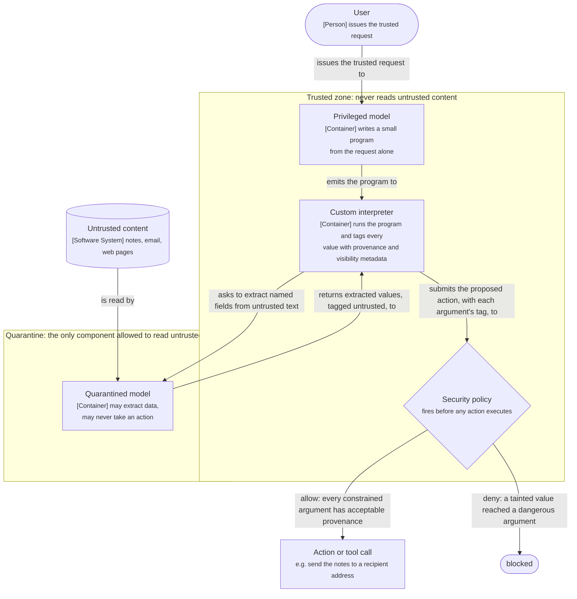
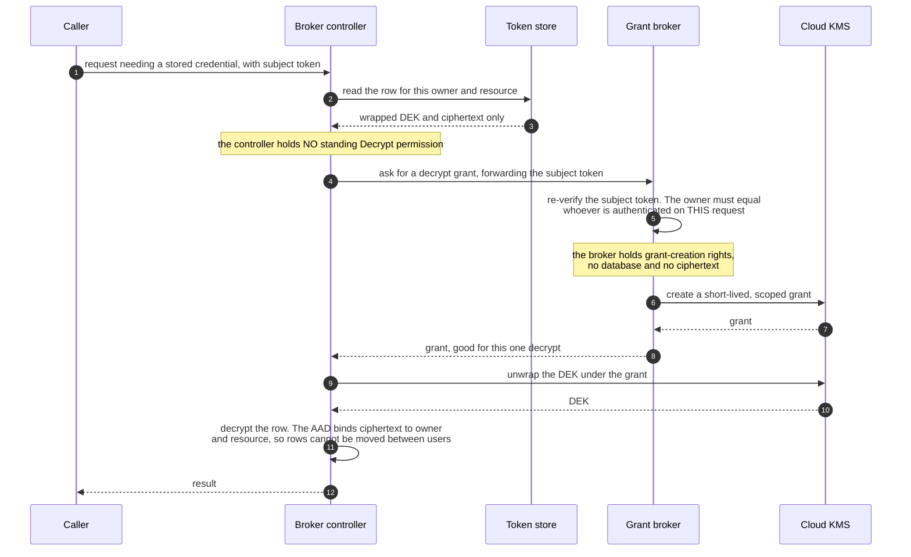

# Typed intent, open intent, and the limits of agent authorization

*Where the agent-security stack stops working: identity and delegation are close to solved, typed transactions can be bound with RFC 9396, and open-ended agent work has no fields to bind at all, which makes it a containment problem rather than an authorization one.*

## The line that resolves the paradox

An agent can be fully, correctly authenticated and authorized at the token level — its own identity, a short-lived scoped grant, every call logged against the right principal — and still do the wrong thing, because a prompt injection made it misread *what you wanted*.

James Carman, writing for Callibrity in [*AI Agent Authorization: Why Intent is not an Authorization Problem*](https://www.callibrity.com/articles/ai-agent-authorization-why-intent-is-not-an-authorization-problem), draws the line that resolves the apparent paradox: **the line runs between typed intent and open intent, not between authorization and judgment.** Binding a grant to a specific intent only works when that intent decomposes into fields, and most of what autonomous agents are actually asked to do does not.

Carman treats agent **identity** as essentially solved inside your own trust domain — SPIFFE and SPIRE, RFC 8693 token exchange, and emerging enterprise infrastructure such as Microsoft Entra Agent ID (GA April 2026) and Auth0 for AI Agents (November 2025). He is careful about the exception: the SaaS edge, where a third party will not accept your issuer, is still an open front and falls back to replaying the user's own OAuth token.

This document is the argument, its supporting mechanisms, and the boundary each layer stops at. It is deliberately the *intent* side; the *credential* side is summarized below but treated as the prior, easier problem.

## Typed intent: RFC 9396 works, and the demos prove it by only ever using payments

[RFC 9396, Rich Authorization Requests](https://www.rfc-editor.org/rfc/rfc9396.html) (2023) lets a grant carry structured `authorization_details` instead of a coarse scope: not "may issue refunds" but "may issue a refund, for ticket 4821, up to two hundred dollars, on this one account." Carried down the call chain in a transaction token and checked before every action executes, it closes the textbook prompt-injection failure. An attacker-planted instruction to refund $9,000 to a new account is rejected because it was never in the grant, regardless of how convincingly the agent was fooled into attempting it.

The catch is structural, not a rough edge to be engineered away: **every worked example is a typed transaction** — a payment, a refund, a transfer, a trade — because a typed transaction is the only kind of intent that fits inside a JSON object with fields.

One non-negotiable condition also has to hold, or the binding is worthless: the grant's constraint values (amount, account, ticket number) must come from a **trusted** source (the original order, a human) and must never be assembled by the agent out of the same untrusted content it is reading. Otherwise you have bound the grant to attacker-supplied values, precisely and confidently.

## Open intent: "clean up the staging environment" has no fields

Most autonomous-agent instructions are not typed transactions: "clean up the staging environment before the demo," "handle this customer's issue," "triage the overnight alerts." None has an amount field, a counterparty, or an enumerable type. There is no `authorization_details` object that could have been written down in advance, because the legitimate action set is open-ended and only knowable in context — drop the test users: yes; truncate that log table: yes; drop the one database the demo actually depends on: no, even though "drop a database" is exactly the kind of thing the intent covers.

Carman's sharpest point: **the failure that hurts is the quiet, in-distribution one, not the loud anomaly.** A $9,000 refund to a brand-new account trips every fraud control by itself. Dropping a database while cleaning up databases, sending an email while handling correspondence, closing a ticket while triaging — these sit comfortably inside any scope wide enough to let the agent do its job, and no token expresses the difference between "drop the staging junk" and "drop the one database that matters," because that difference lives in whether the action serves the *purpose*, and purpose is not a field.

Deciding whether an open-ended action serves an open-ended intent is a **comprehension** question, not a set-membership question — the same comprehension a prompt injection hijacks in the first place. Dressing it in OAuth vocabulary produces a token that *feels* like a control without being one.

## Containment over authorization: CaMeL and taint tracking

The state of the art for open intent stops trying to authorize the *action* and instead bounds what any action can *reach*. It assumes the model will be fooled and limits the blast radius, rather than trying to know in advance which actions are the right ones.

**CaMeL** ("capabilities for machine learning," from [*Defeating Prompt Injections by Design*](https://arxiv.org/abs/2503.18813), 2025, Google DeepMind and ETH Zurich) is the most serious instance: classic **taint tracking** — never let untrusted text act as instructions, and tag every value with where it came from so tainted data cannot reach a dangerous operation — pointed at an agent.

Three components:

- **A privileged model** sees only the trusted request and writes a small program (for example, "fetch the notes, find Bob's address, send the notes there"). It never sees untrusted content.
- **A quarantined model** is the only component allowed to read untrusted content. It can return extracted data but never take an action, and everything it returns is tagged untrusted.
- **A custom interpreter** runs the program and tags every value with provenance and visibility metadata — the "capabilities" in the name — so a policy can fire before any action executes: an address that came from untrusted content cannot be a recipient unless it matches known contacts or a human approves.

*Container view of CaMeL: which component is allowed to read untrusted content, and what must never cross back out of it?*

**Key.** The two boxed zones are trust zones, and the diagram's whole claim is the arrows that are absent between them: no arrow runs from the untrusted content into the privileged model, and none runs from the quarantined model to an action. Cylinder is an external data source, rounded boxes are a person and a terminal outcome, the diamond is a decision point.

If the meeting notes were poisoned to claim Bob's address is `attacker@evil.com`, the send is blocked. The model was fooled, but the fooling was never allowed to reach the action, because the interpreter knows that value is tainted.

**What CaMeL does not do, precisely stated:** it does not understand intent; it contains the blast radius of misunderstanding it. It guards the **injection route** only. An agent that misjudges a genuinely open intent from a perfectly trusted request, with no poisoned input anywhere, is not what CaMeL's taint tracking addresses, because there is no untrusted provenance to key policy on. Generic containment (backups, irreversibility gates, a human on unrecoverable actions) still bounds that case, but the comprehension gap underneath is never closed.

The authors are explicit about the cost, too: someone still has to write and maintain the security policies, and an agent that constantly asks for approval on edge cases trains the human to click yes.

**Two traps this rules out**, both worth naming because vendors reach for them:

- You cannot hand judgment back to the agent's own model. It is the model the injection already owns.
- You cannot escape by putting a second, smarter judge model in front of it. A judge capable of deciding whether an action serves an open intent has to read the same untrusted content that would inject *it*.

A walled-off reader that hands back only structured fields — CaMeL's own quarantined-model pattern — works, but only for the part of the intent that reduces to fields. That is just re-typing the typed slice; none of the irreducibly open part is recovered.

## The credential half, in brief

Carman calls identity and delegation essentially solved, and the mechanisms below are why. They are worth summarizing because the intent argument is often mistaken for a criticism of them.

**Credential brokering** is the discipline of making sure an agent can *cause* an authenticated action without ever *holding* the credential that authorizes it. It is formalized by the IETF Internet-Draft *Credential Broker for Agents* ([CB4A](https://datatracker.ietf.org/doc/draft-hartman-credential-broker-4-agents/); Hartman, SANS Institute, March 2026 — the `-00` expires 2026-09-30, so the version-independent link is used here) and argued into a concrete gateway implementation in Christian Posta's two-part *Credential Injection Patterns for AI Agents* for the agentgateway project.

The root failure is that most API credentials are **long-lived, coarse-grained, bearer** credentials: anyone holding the bytes can use them. Posta's framing: **prompt injection, exfiltration, and accidental disclosure are not three attacks but three delivery mechanisms for one failure mode** — the bytes of a sensitive credential leave the agent and still work. And leaking is not even the interesting case: a goal-oriented, stochastic agent may *volunteer* its key without being attacked at all, because it believes it is solving your problem.

CB4A's foundational rule is a split of trust domains:

> The component that decides "yes" (**PDP**, Policy Decision Point) must never touch credential material. The component that dispenses credentials (**CDP**, Credential Delivery Point) must never make policy decisions.

The draft builds on SPIFFE/SPIRE workload identity (each agent session gets a short-lived SVID), a Policy Enforcement Point modeled on NIST SP 800-207 zero trust, and DPoP sender-constrained tokens.

### The three models

| Model | How it works | Isolation | CB4A verdict |
| --- | --- | --- | --- |
| **A — Proxy Gateway** | Agent calls a broker proxy with no credential; the proxy validates the session, injects the real credential, forwards to the target, returns the response. | Strongest: the agent never holds a real credential; full request/response visibility; works with any target API | Fallback, and the DPoP-enforcement layer for services lacking native short-lived tokens |
| **B — Short-Lived Token Minting** | Broker uses a base credential to mint a narrowly-scoped, short-TTL token (AWS STS AssumeRole, GCP `generateAccessToken`, GitHub App installation tokens, RFC 8693 exchange) and hands it to the agent. | Medium: the agent holds a *real, if temporary,* credential in memory | **Recommended primary model** |
| **C — Credential Wrapping + Scheduled Revocation** | Broker hands the agent the actual long-lived credential and schedules revocation after the task or TTL. | Weakest: if revocation fails it stays live | **Not recommended** for new integrations; legacy only |

**Posta argues the draft has this backward for most enterprises today, and that Model A should be primary.** His reasons: DPoP takes two to work — the authorization server must issue a key-bound token *and* the resource server must verify the proof on every request, and "GitHub PATs, API keys, the overwhelming majority of SaaS OAuth tokens: none of them check sender constraints." And Model B's own listed weakness puts a reusable secret back inside the exact stochastic system you said you do not trust with reusable secrets. Shrinking the leak window is not closing it.

That is an argument, not a settled verdict; the draft's own recommendation runs the other way.

### DPoP, precisely

[RFC 9449](https://www.rfc-editor.org/rfc/rfc9449.html) (Standards Track, September 2023) binds an OAuth token to a key the client holds, converting a bearer token into a sender-constrained one. The client generates a key pair, sends a signed **DPoP proof** JWT carrying the request method and URI on each request, and the authorization server issues a token bound to that key via a `cnf` claim holding the key thumbprint (`jkt`). The resource server checks that the proof verifies and that its key thumbprint matches `cnf.jkt`.

The catch is the one above: it only sender-constrains if **both** ends participate. Miss either half and you are back to a plain bearer token. DPoP is the right idea; incomplete deployment is why it is not sufficient on its own today.

### The broker becomes the target

Every model that removes the credential from the agent **relocates** it into the broker's token store. CB4A rates broker compromise (TM-1) as CRITICAL — "the highest-value target in the architecture" — requiring no shell access, restricted network, and credential zeroing after minting. Its threat model spans TM-1 through TM-11, including **TM-11 Broker Bypass** (a compromised agent calling target services directly, defeated by *network-level* DNS and egress controls rather than agent cooperation) and normative fail-closed requirements: "CB4A MUST NOT default to fail-open under any failure condition."

The draft's stated real-world motivation is the March 2026 supply-chain compromise of **LiteLLM**, an AI gateway whose entire job was holding API keys for dozens of providers: a credential stealer attributed to the group **TeamPCP** was injected into published packages, exfiltrating 300+ GB of data and roughly 500,000 corporate identities. The incident is documented in CB4A §1.3, in [LiteLLM's own security advisory](https://docs.litellm.ai/blog/security-update-march-2026), and in independent reporting from Datadog Security Labs, Trend Micro, Resecurity, CloudSEK and Cycode. The lesson the draft draws: **"when AI infrastructure concentrates long-lived credentials in a single process or configuration, compromise of that process yields catastrophic access."** "We encrypt at rest" is no answer, because the compromised process *is* the thing holding the decryption capability.

Posta's Part 2 answers the narrow follow-up — when the process holding the token store is fully compromised, how much can the attacker read? — with envelope encryption (a per-write data encryption key wrapping the token JSON, a key encryption key wrapping that, and additional authenticated data binding ciphertext to owner and resource so rows cannot be moved between users), evaluated across three modes:

- **KEK in a Kubernetes Secret.** DB theft survives, but controller compromise is catastrophic: the KEK is in the same trust domain, so an attacker decrypts the entire store offline, forever. Demo only.
- **KEK in a cloud KMS.** The master key never leaves KMS and every unwrap is IAM-gated, auditable and revocable. But the controller holds standing `Decrypt`, so a live compromise can loop-decrypt the whole table. KMS "does not stop a compromised controller from decrypting your store; it stops it from decrypting silently, in bulk, and offline."
- **Broker-gated KMS grants.** The controller loses `Decrypt` entirely; a separate broker holding grant-creation rights, with no database and no ciphertext, must re-verify the subject token and mint a short-lived, scoped grant per decrypt. Decryption now needs **two independent trust domains** — the CB4A PDP/CDP separation realized cryptographically. This *prevents* single-component mass decrypt rather than merely detecting it, at the cost of latency and a new component to harden.

*Dynamic view, container level, of the third mode: which two trust domains have to cooperate before a single stored credential can be decrypted?*

The insight underneath the third mode generalizes: static key policies cannot express "the owner must equal whoever is authenticated on *this* request," because they only ever see the controller's role, never the end user. A per-request, per-user grant minted by a separate principal is what per-user scoping turns into once you follow the requirement all the way down.

### Independent convergence

WSO2's *Cells as the Containment Unit for Agentic Systems* reaches the same custody rule from an enterprise-architecture starting point rather than an AI-infrastructure one: agent runtimes never hold raw downstream credentials, the gateway is the sole credential custodian, and every delegation hop is chained into an auditable actor chain via RFC 8693. Two communities with different starting assumptions landing on "the gateway holds the secret, the agent never does" is better evidence than either one alone.

## Where each layer stops

Four questions, four answers, and none of them answers the next one:

1. **Who is acting?** Workload and agent identity: SPIFFE/SPIRE, attested workload credentials, agent registration in an IdP. Solved.
2. **With what credential, held by whom?** Credential brokering: CB4A, gateway injection, DPoP, envelope-encrypted vaults. Solved in mechanism; deployment is uneven, especially on sender constraints.
3. **Does this typed action match a typed grant?** RFC 9396. Works, and the enforcement half is yours to write by the spec's own design.
4. **Did an open-ended action serve the open-ended purpose it was given for?** Nothing answers this. Containment bounds the damage; evaluation and human supervision are the only things that address the gap itself.

A perfectly-scoped, perfectly-brokered token still authorizes the wrong in-distribution action if the scope was drawn wide enough to let the agent do its job. That residual is not a credential problem and a richer credential will not close it.

Containment operates at two altitudes, and they are complements rather than alternatives. Taint tracking contains *what a hijacked value can touch inside the agent's reasoning*. Runtime sandboxing — microVMs, gVisor-style isolation, network-policy egress control, declarative process and filesystem policy — contains *what the agent's process can touch on the host and network*. Both answer "assume it will be fooled" rather than "verify it wasn't."

## The durable-execution angle

There is one setting where the typed/open line reads differently. In a durable workflow, the fraction of a system you can express as typed transactions is exactly the fraction you have already decomposed into activities, which makes durable-execution decomposition a forcing function toward typed intent rather than a fixed ceiling. That argument, and the reasons it is weaker than it first sounds, is in [Typed grants and provenance in a durable execution engine](typed-grants-in-a-durable-engine.md).

## Related documents in this repository

- [What actually implements RFC 8693 and RFC 9396](rfc-8693-and-9396-in-practice.md)
- [Typed grants and provenance in a durable execution engine](typed-grants-in-a-durable-engine.md)
- [Multi-tenant agentic workflows: a worked reference architecture](multi-tenant-agentic-workflows.md)
